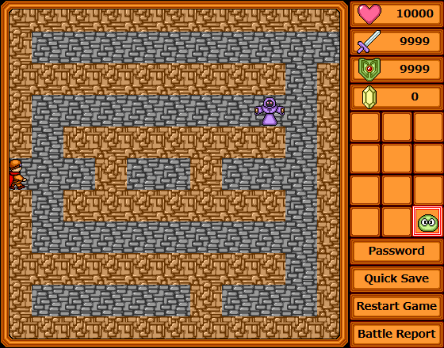
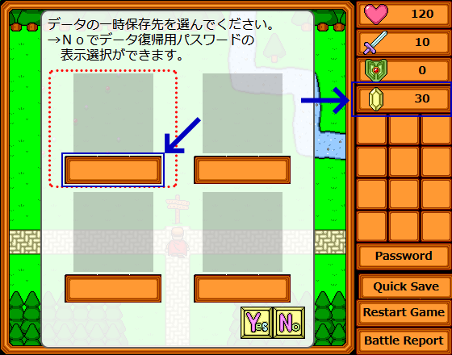

WWA Wing Team です。

WWA Wing v.3.5.4 をリリースしました。今回のリリースには `$oldmove` マクロの追加が含まれています。

## 内容

### $oldmove マクロの追加
`$oldmove` マクロとは、物体パーツの動作属性である「プレイヤー追尾」と「逃げる」の強さを変更することのできるマクロ文です。

`$oldmove=1` と指定することで、「プレイヤー追尾」と「逃げる」の強さを弱くすることができます。

「プレイヤー追尾」では相手から逃げやすくなり、「逃げる」では相手に捕まりやすくなります。下図のアニメーションから、追いかける相手に対して逃げやすくなっていることが分かります。

言い方を変えると、 Java版 WWA の v3.02c 以前の挙動にもどります。元々「プレイヤー追尾」と「逃げる」の挙動は `$oldmove=1` に設定したものと同じでしたが、 v3.10 のアップデートによって強化され、頑張れば相手から逃げ切れるマップでは逃げ切れなくなり、頑張れば相手に捕まえられるマップでは捕まえられなくなり、一部のマップで支障が生じました。

そういったこともあって、今回のマクロ文の追加に踏み切ったことになります。

もちろん、 `$oldmove=0` と指定することで、従来通り「プレイヤー追尾」と「逃げる」の強さを戻すこともできます。

過去の WWA を知らない人でも、この `$oldmove` マクロには役に立つのではないかと思います。 Standard Map に解説キャラクターを追加しましたので、ぜひお試しください。

### スタイルシートの調整
開発で使用しているスタイルシートのモジュールを調整しました。ユーザー側での影響はありません。

詳しく言いますと、 WWA の画面で使用されている操作パネルのステータス欄や Quick Save などのボタンのスタイルシートを共通化し、 Quick Save や Quick Load のセーブデータ選択画面の生命力のステータス欄でも同じスタイルシートができるようにしていました。

下図で説明しますと、青矢印に示した箇所のスタイルシートを共通化しています。

