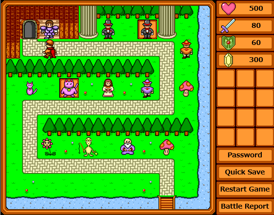
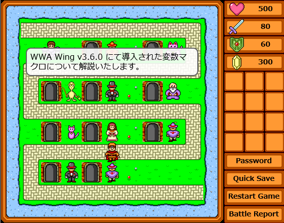
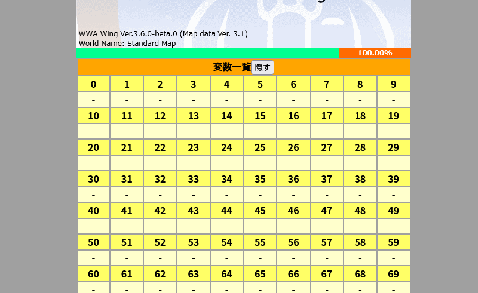
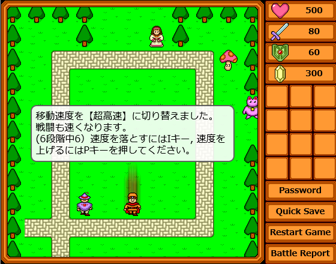

WWA Wing Team の Aokashi です。変数や条件分岐など、様々な拡張マクロ文を追加した WWA Wing v3.6.0 をリリースしました。

## 新機能をひと目で知りたい！
[Standard Map](https://wwawing.com/wing/wwamap.html) より、新しく追加された変数やマクロ文などを試すことができます。左上のゲートから、一番最後のキャラクター横のゲートに移動して、新機能をお楽しみください。





また、WWA Wing v3.6.0 リリースに併せて、サンプルゲームを WWA コミュニティのメンバーに制作してもらいました。

調整の都合上、公開までしばらくお待ちいただければと思います。

## 追加内容
詳しい追加内容は [WWA Wing マニュアル](https://wwawing.notion.site/wwawing/WWA-Wing-1fca5acaf51a4df38b953c478c8b9a5e) に記載していますので、こちらと併せてお読みください。

### 「変数」の概念の追加
WWA Wing に、変数が追加されます！

これまで WWA では下記のケースを扱うことが困難でした。

- モンスターを倒した数の管理、判定 (アイテムの管理はアイテムボックスを圧迫するしなあ・・・)
- コマンドバトルの相手の生命力の管理、判定 (他のステータスを借りて使用したくないし、他に方法はあるの？)
- メニュー画面のような、どこでも特定の位置に行ったり来たりできる装置 (行くのはいいけど、戻るときの座標は・・・)

変数を利用することで、これらをより簡単に実現することができます。

1つのゲームにつき、256個までの変数が扱えます。

変数に数値を入れたり、変数の数値から各種ステータスに入れたりする場合はマクロ文を使用します。

変数の活用は「やりたいこと」からより細かく手順を分解する必要があります。 WWA の制作をはじめて間もない場合は扱いに苦戦するかもしれません。まずは変数機能を使用しないで作ってみて、「ここが不便だよなあ」と感じ始めてから変数機能を活用すると良いと思います。

- [7. ユーザー変数](https://wwawing.notion.site/7-5a4b3d475684414683242ded9fd57694)

### 変数にまつわるマクロ文の追加
前述の変数を扱うマクロ文がいくつか追加されています。

1. まずは変数に固定値を入れてみましょう。 `$var_set_val` で指定した値を変数に入れることができます。
2. 変数は足したり引いたりできます。 `$var_add` や `$var_sub` などで四則演算ができます。また、 `$var_mod` で割ったあまりを求めることもできます。
3. 変数を攻撃力や防御力に設定するには `$set_at` や `$set_df` などを使用します。
4. 変数が特定の値になったか条件分岐をしたい場合は `$if` を使用します。
5. 結果をメッセージに表示したい場合は `$show_str` を使用します。

変数とやり取りできる値はステータスだけではありません。

- プレイヤー位置 (変数に入れる `$rec_pos` や変数から特定の場所にジャンプする `$jump_rec_pos`)
- ゲーム開始時刻 (変数に入れる `$copy_time_to`)
- 移動回数 (変数に入れる `$copy_step_count_to`)

ゲーム開始時刻では、特定のタイミングに入れることで、経過時刻を算出することができます。

- [4. マクロ一覧](https://wwawing.notion.site/eaaeb453a5054474aaecf34e4d66b534?v=6339f153810040f4877101ed6d3cd04f)

### 変数表示機能を追加
WWA Wing を自分の PC でデバッグする際に便利な変数表示機能を用意しております。



WWA をプレイする際に使用する HTML ファイルを編集する必要があります。

1. `<body>` から `</body>` までの適当な位置に `<div id="vardump"></div>` を追加します。
2. `<div ... id="wwa-wrapper">` の箇所に属性 `data-wwa-var-dump-elm="#vardump"` を追加します。

HTML ファイルの `#wwa-wrapper` 周辺では下記の通りになっていると思います。これで変数ビューワが表示されます。

```html
<div
  class="wwa-size-box"
  id="wwa-wrapper"
  data-wwa-mapdata="wwamap.dat"
  data-wwa-urlgate-enable="true"
  data-wwa-title-img="cover.gif"
  data-wwa-autosave="200"
  data-wwa-var-dump-elm="#vardump"
>
</div>
<div id="vardump"></div>
```

- [7. ユーザー変数](https://wwawing.notion.site/7-5a4b3d475684414683242ded9fd57694)

### ゲームスピードの拡張
ゲームスピードが下記の通りに変わります。

- 前：「低速」「準低速」「中速」「高速」の4つ
- 後：「超低速」「低速」「準低速」「中速」「高速」「超高速」の6つ



### 便利なマクロ文の追加
変数を併用する上で便利なマクロ文もあります。

- 特定のステータスを隠す `$hide_status`
- 変数をブラウザーの開発者ツールのコンソールに表示する `$console_log`
- ゲームスピードの変更を禁止にできる `$game_speed`

- [4. マクロ一覧](https://wwawing.notion.site/eaaeb453a5054474aaecf34e4d66b534?v=6339f153810040f4877101ed6d3cd04f)

## 今後の予定について
今後のアップデートではスマートフォンでの操作がしやすくなる仮想パッドの追加を予定しています。仮想パッドについては自分が制作した [謎めいた機械を追い求めて](https://www.aokashi.net/wwa/strange_machine/) で試すことができます。ご意見をお待ちしております。

今年も WWA Wing をご利用いただき、ありがとうございました。来年も WWA Wing Team をよろしくお願いします。
