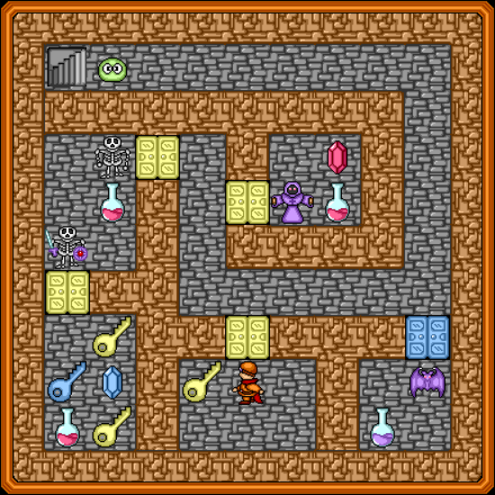

WWA Wing Team です。2021年もよろしくお願い致します。

WWA Wing v3.5.5 をリリースしました。今回のリリースでは、細部のバグ修正を行いました。

## 不具合修正の内容

アイテム取得と消費がほぼ同時に行われた時に、アイテムが消費されないかのように見える不具合を修正しました。
具体的にどのようなケースでこの事象が発生するかについて解説します。[ケーブダンジョン (Level 1)](https://wwawing.com/wing/caves01.html) の冒頭部で、次のような鍵と扉の配置があります。

ここで、キーボードの「左」と「上」のカーソルキーを「左」→「上」の順で高速に押すと、扉が開いたにも関わらず、鍵が消費されないように見える不具合がありました。
扉が開いた後、内部的には鍵は消費されているのですが、表示上、アイテムボックスには鍵が残り続けているという状態が発生していました。

## 今後の予定

次にリリースする予定のバージョンでは、マップデータが更新された時のセーブデータの互換性についての見直しが行われる予定です。

また、Microsoft 社による古い Edge ブラウザ (EdgeHTML バージョン18以下) のサポートがまもなく終了するため、サポートブラウザの見直しを行います。

今後とも WWA Wing をよろしくお願いいたします。