こんにちは。 WWA Wing Team です。

WWA ゲームを制作する際に必要になるグラフィック素材を、皆さんはどこから取り入れていますか？ 標準素材のままで済ませていたり、全て自分で制作したり、あるいは他人が制作した WWA 画像素材をそのまま使用したりする人もいるでしょう。

ただし、他人が制作した WWA 素材画像は、下記のように WWA ゲームを動かす上で必要な配置になっていない場合もあります。もしそうでなくても、欲しいキャラクター素材やマップチップ素材だけを取り出したい場合があると思います。

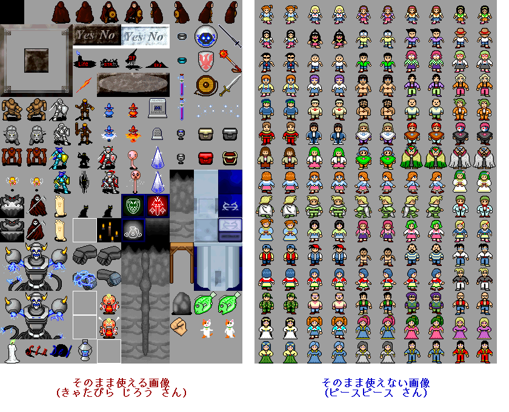

- **WWA ゲームを動かす上で必要な配置** については、 WWA マップ作成ツールのマニュアルの「画像関連」をご参照ください
    - WWA マップ作成ツールのマニュアルは WWA Wing の完全版の wwamk_manual.html になります

ここでは、そんな WWA 画像素材をマス単位で WWA ゲームの GIF 画像に取り入れる方法をご紹介します。

今回の紹介にあたっては、下記の環境を使用しています。

- OS: Windows 10 Pro (2004)
    - Windows 10 Home でも同様に操作出来るはずです

## 1. 編集ソフトの導入

WWA 画像素材を WWA ゲームの GIF 画像に取り入れるには画像編集が必要なため、画像を編集できるソフトウェアが必要になります。

WWA で使用する画像ファイルは GIF 形式です。 [キャラバンサークルで説明されている](https://wwajp.com/wwafaq.html) 通り、EDGE のご利用がおすすめです。そのため、 **ここでも EDGE を利用する形で説明します**。

- [EDGE のページ](http://takabosoft.com/edge)

## 2. グリッドと編集単位の設定

早速画像を埋め込みたいところなんですが・・・まずは **グリッドと編集単位** を設定すると、より便利に画像編集ができます。事前にグリッドと編集単位を設定することをおすすめします。

いずれも設定から変更することができます。まずは、メニューバーの 設定(T) にある 設定(T)... を選びます。

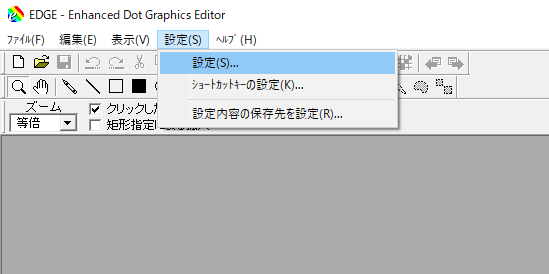

### 2.1. グリッド

**グリッド** とは、画像の1マス1マスを区別するために表示する格子状の線です。設定画面の グリッド タブから、 グリッド(大) の間隔 で大きさが設定できます。

**横幅縦幅ともに 40** と設定しましょう。

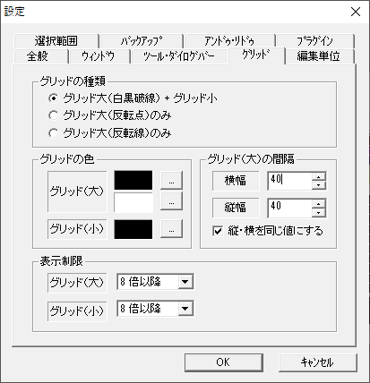

### 2.2. 編集単位

**編集単位** とは、画像の一部分を選択する場合に扱う単位の大きさです。普段選択に使う単位は1ピクセルですが、編集単位を 40ピクセル と設定すると、 WWA で扱う 1マス単位 で画像を選択することができ、大変便利になります。設定画面の 編集単位 タブから、 編集単位 で大きさが設定できます。

ここで、 **グリッド(大)と同じ値にする** にチェックを入れましょう。


## 3. 画像素材ファイルの取得

さて、すでに WWA 画像素材をお持ちであればこの手順はスキップしても構いません。しかし、まだお持ちでない場合は、少し面倒ではありますが、自分の力で探してみましょう。

- 最初は [WWA 画像素材集](https://wwajp.com/material.html) から画像素材を使用することをおすすめします。
- 上記から見つからなければ、検索などで探しましょう。 [WWA 素材 と検索する](https://www.google.com/search?q=WWA+%E7%B4%A0%E6%9D%90) だけでもある程度は見つかります。

もし WWA 用でも希望のものが見つからないのであれば、 WWA 用以外の画像素材を探すことになります。が、注意事項があります。

- **利用規約をよくご確認ください。**
    - 特定の用途以外での使用が禁止されているものもありますが、それらは使わないでください。 (例: RPGツクール RTP)
- サイズや画像ファイルの形式が異なるため、一度 GIF 形式に変換したり、リサイズしたりする必要があります。
    - この作業は EDGE では使用できず、テクニックが必要になるので、難しいのであれば諦めるのも一つの選択です。

WWA 用以外で唯一サイズが一緒なものとして、 WOLF RPG エディターの 800 × 600 解像度が挙げられますが、あまり使用されることが無いことと、ファイル形式が異なることから、「WWA 用で見つからないから使おうか」程度の感覚で頼るのが無難だと思います。

今回のコラムの執筆にあたって、 WWA 画像素材集にある朱雀さんの画像素材を使用します。

## 4. 埋め込み作業のセットアップ

### 4.1. 画像ファイルを開く

ツールバーにあるフォルダのアイコンから、画像ファイルを開くことができます。ここで、WWAの制作に使う画像ファイルと、埋め込みたい素材の画像ファイルを開きます。

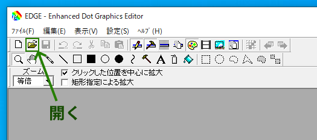

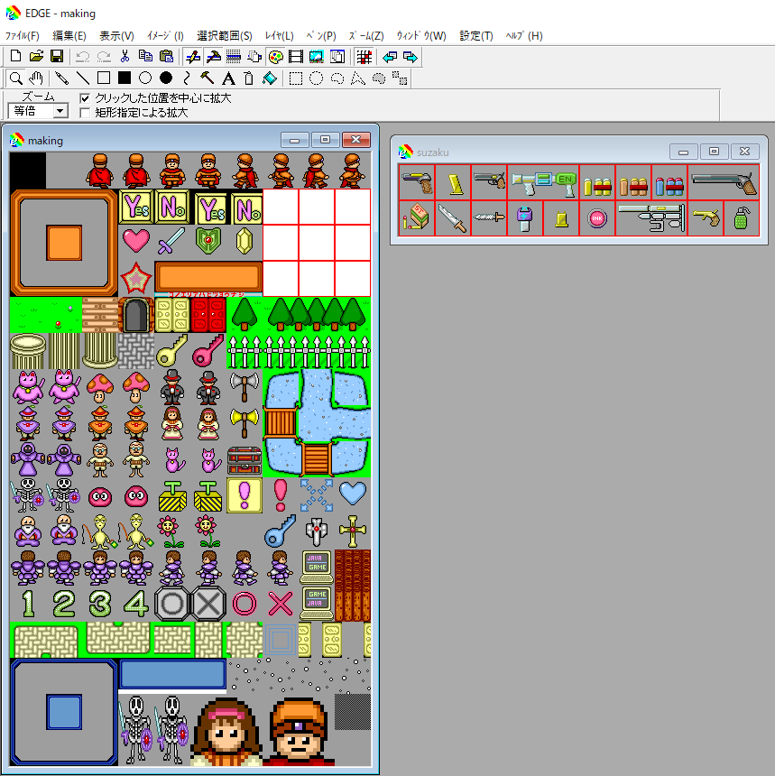

次に、画像を選択したいので矩形領域を選択するようにします。ツールバーの四角い点線のアイコンをクリックします。また、編集単位を使用するように忘れずに **編集単位使用** にもチェックを入れましょう。

[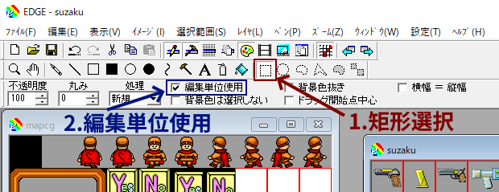](edge_set_edit_unit_with_select.png)

(画像クリックで画像だけ見られます)

### 4.2. 画像ファイルのコピー

埋め込みたい素材の画像ファイルから、画像を選択します。

- 1マスだけの素材であれば、欲しい箇所をそのままクリックするだけです。
- まとめて素材を埋め込みたい場合は、欲しい箇所をドラッグします。

ここで、以下の図のように欲しい箇所が点線で囲まれていればOKです。

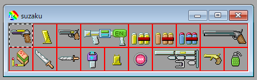

次に、コピーの操作を行います。ツールバーの操作からでもコピーはできますが、ここではキーボードで操作します。 Ctrlキー と Cキー を一緒に押します。これでコピーの操作は完了です。

## 5. ゲーム画像ファイルへの取り込み

### 5.1. 画像ファイルの貼り付け

制作する WWA の画像ファイルに、コピーした画像を貼り付けます。

制作する WWA の画像ファイルを選択し、キーボードの **Ctrlキー と Vキー** を一緒に押します。すると、左上に欲しかった素材の画像が表示されると思います。

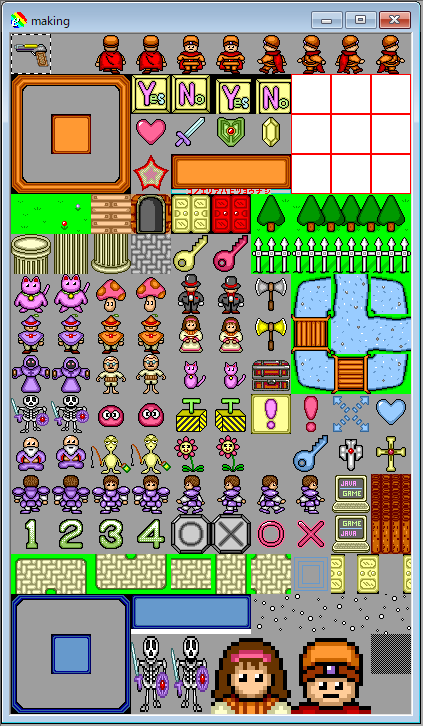

その画像をそのまま空欄にドラッグ操作で持っていきます。これで貼り付け操作と画像の移動は完了です。

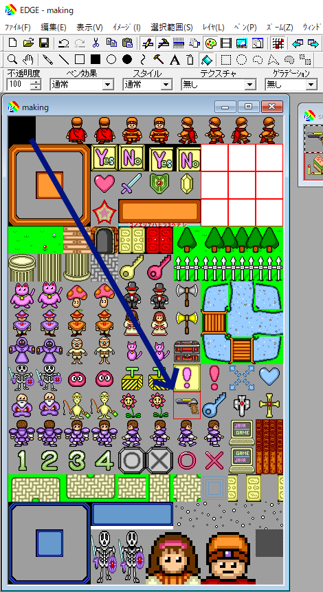

- ちなみに、コピーと貼り付けで画像ファイルなどをやり取りする領域を「 **クリップボード** 」と言います。

### 5.2. グリッドによる位置の確認

画像がちゃんと位置どおりに配置できたか確認するため、グリッドを表示します。ツールバーのグリッドのアイコンからグリッドを表示することができます。

1. まずはズームしてみましょう。ツールバーの虫眼鏡のアイコンからズームの操作に移ります。
2. 編集している画像の中で、配置した画像素材のあたりをクリックしてズームします。
    - 右クリックでズームアウトできます。
    - 違う方向に進んでしまった場合は **Shift キーを押しながらドラッグ操作** をすることで視点を移動できます。
3. ツールバーのグリッドのアイコンからグリッドを表示します。

[](edge_zoom_up_wwa_game_image.png)

(画像クリックで画像だけ見られます)

### 5.3. 後始末

これで完了... **ではありません**。 WWA の画像素材によっては制作者が編集しやすくするために、下記のようにそのまま使用できないものもあります。

- ゲーム上では透明であるべき箇所「 **背景色** 」が使用している WWA ゲーム画像と違う
- マスの境界線が残っている

今回は、上記のような状態を解消するために調整します。

1. ツールバーのバケツのアイコンから塗りつぶしの操作に移ります。
2. 背景色を知りたいので、背景色の部分に右クリックします。
3. 貼り付けた素材の背景色や境界線をクリックして、背景色を変えたり境界線を消したりします。
4. 編集している画像が小さければズームを使用します。

[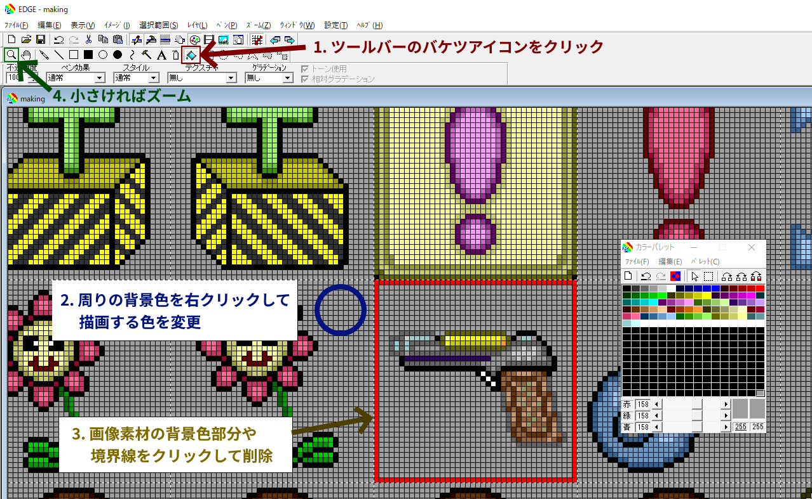](edge_adjust_wwa_game_image.png)

(画像クリックで画像だけ見れます)

あとは画像ファイルを保存します。キーボードの **Ctrlキー と Sキー** を一緒に押して、保存の操作は完了です。

## 6. 確認

画像素材を埋め込んだら早速 WWA マップ作成ツールで確認しましょう。すでにマップデータを開いている場合が一度閉じる必要があります。

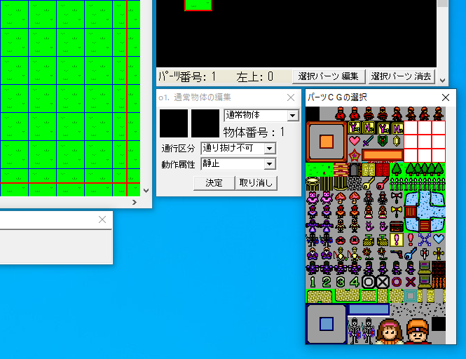

埋め込んだ画像素材が含まれていれば成功です。お疲れさまでした。

## 最後に

WWA の画像素材は画像編集ソフトを通じて制作している WWA ゲームに取り込むことができます。

WWA の標準素材ではバリエーションが少ないため、例えばベッドのつもりでアイテムボックスの背景を使用したりする必要はあるかもしれません。インターネットで公開されている WWA 画像素材を活用すれば、そういった妥協を減らすことができます。

なお、画像素材の作者によって作風は異なりますので、グラフィックの雰囲気が統一できないですが我慢しましょう。

### 画像提供元は書こう！

今回使った画像素材が自作でなければ、「～から素材を借りました」とゲームの紹介文などに明記しておきましょう。明記しないと、使った画像素材があたかも自分 (＝ゲーム制作者) が自作したかのように勘違いされてしまい、トラブルの原因になります。

表記方法については、画像素材の提供元の利用規約などからご確認することになりますが、なければ下記のように自由で良いでしょう。

```
～さんの素材を使用しました。
```

```
画像提供元：
・(サイト名) (URL)
```

なお、利用規約に明記が不要な場合は明記しなくても構いませんが、「この素材なんだっけ？」とユーザーが探すきっかけにもなりますので、明記をおすすめします。
