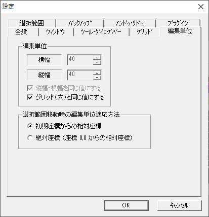
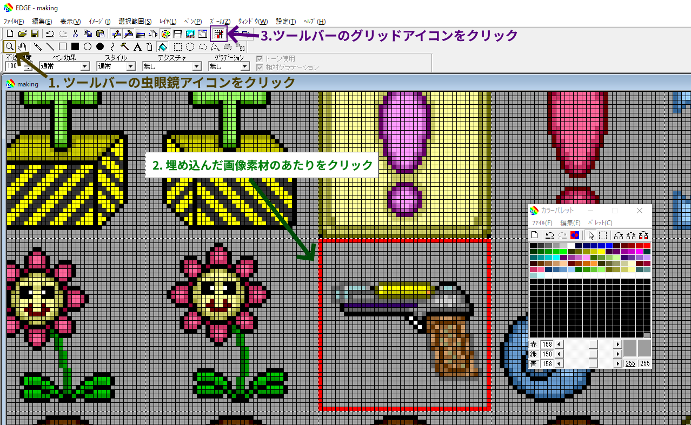

こんにちは。 WWA Wing Team です。

WWA ゲームを制作する際に必要になるグラフィック素材を、皆さんはどこから取り入れていますか？ 標準素材のままで済ませていたり、全て自分で制作したり、あるいは他人が制作した WWA 画像素材をそのまま使用したりする人もいるでしょう。

ただし、他人が制作した WWA 素材画像は、下記のように WWA ゲームを動かす上で必要な配置になっていない場合もあります。もしそうでなくても、欲しいキャラクター素材やマップチップ素材だけを取り出したい場合があると思います。

ここでは、そんな WWA 画像素材をマス単位で WWA ゲームの GIF 画像に取り入れる方法をご紹介します。

今回の紹介にあたっては、下記の環境を使用しています。

- OS: Windows 10 Pro (2004)
    - Windows 10 Home でも同様に操作出来るはずです

## 1. 編集ソフトの導入

WWA 画像素材を WWA ゲームの GIF 画像に取り入れるには画像編集が必要なため、画像を編集できるソフトウェアが必要になります。

WWA で使用する画像ファイルは GIF 形式です。 [キャラバンサークルで説明されている](https://wwajp.com/wwafaq.html) 通り、EDGE のご利用がおすすめです。そのため、 **ここでも EDGE を利用する形で説明します**。

- [EDGE のページ](http://takabosoft.com/edge)

## 2. グリッドと編集単位の設定

早速画像を埋め込みたいところなんですが・・・まずは **グリッドと編集単位** を設定すると、より便利に画像編集ができます。事前にグリッドと編集単位を設定することをおすすめします。

いずれも設定から変更することができます。まずは、メニューバーの 設定(T) にある 設定(T)... を選びます。

### 2.1. グリッド

**グリッド** とは、画像の1マス1マスを区別するために表示する格子状の線です。設定画面の グリッド タブから、 グリッド(大) の間隔 で大きさが設定できます。

**横幅縦幅ともに 40** と設定しましょう。

### 2.2. 編集単位

**編集単位** とは、画像の一部分を選択する場合に扱う単位の大きさです。普段選択に使う単位は1ピクセルですが、編集単位を 40ピクセル と設定すると、 WWA で扱う 1マス単位 で画像を選択することができ、大変便利になります。設定画面の 編集単位 タブから、 編集単位 で大きさが設定できます。

ここで、 **グリッド(大)と同じ値にする** にチェックを入れましょう。

## 3. 画像素材ファイルの取得

今回のコラムの執筆にあたって、 [WWA 画像素材集](https://wwajp.com/material.html) にある朱雀さんの画像素材を使用します。

### 3.1. 画像ファイルを開く

ツールバーにあるフォルダのアイコンから、画像ファイルを開くことができます。ここで、WWAの制作に使う画像ファイルと、埋め込みたい素材の画像ファイルを開きます。

次に、画像を選択したいので矩形領域を選択するようにします。ツールバーの四角い点線のアイコンをクリックします。また、編集単位を使用するように忘れずに **編集単位使用** にもチェックを入れましょう。

(画像クリックで画像だけ見られます)

### 3.2. 画像ファイルのコピー

埋め込みたい素材の画像ファイルから、画像を選択します。

- 1マスだけの素材であれば、欲しい箇所をそのままクリックするだけです。
- まとめて素材を埋め込みたい場合は、欲しい箇所をドラッグします。

ここで、以下の図のように欲しい箇所が点線で囲まれていればOKです。

次に、コピーの操作を行います。ツールバーの操作からでもコピーはできますが、ここではキーボードで操作します。 Ctrlキー と Cキー を一緒に押します。これでコピーの操作は完了です。

## 4. ゲーム画像ファイルへの取り込み

### 4.1. 画像ファイルの貼り付け

制作する WWA の画像ファイルに、コピーした画像を貼り付けます。

制作する WWA の画像ファイルを選択し、キーボードの **Ctrlキー と Vキー** を一緒に押します。すると、左上に欲しかった素材の画像が表示されると思います。

その画像をそのまま空欄にドラッグ操作で持っていきます。これで貼り付け操作と画像の移動は完了です。

- ちなみに、コピーと貼り付けで画像ファイルなどをやり取りする領域を「 **クリップボード** 」と言います。

### 4.2. グリッドによる位置の確認

画像がちゃんと位置どおりに配置できたか確認するため、グリッドを表示します。ツールバーのグリッドのアイコンからグリッドを表示することができます。

1. まずはズームしてみましょう。ツールバーの虫眼鏡のアイコンからズームの操作に移ります。
2. 編集している画像の中で、配置した画像素材のあたりをクリックしてズームします。
    - 右クリックでズームアウトできます。
    - 違う方向に進んでしまった場合は **Shift キーを押しながらドラッグ操作** をすることで視点を移動できます。
3. ツールバーのグリッドのアイコンからグリッドを表示します。

(画像クリックで画像だけ見られます)

### 4.3. 後始末

これで完了... **ではありません**。 WWA の画像素材によっては制作者が編集しやすくするために、下記のようにそのまま使用できないものもあります。

- ゲーム上では透明であるべき箇所「 **背景色** 」が使用している WWA ゲーム画像と違う
- マスの境界線が残っている

今回は、上記のような状態を解消するために調整します。

1. ツールバーのバケツのアイコンから塗りつぶしの操作に移ります。
2. 背景色を知りたいので、背景色の部分に右クリックします。
3. 貼り付けた素材の背景色や境界線をクリックして、背景色を変えたり境界線を消したりします。
4. 編集している画像が小さければズームを使用します。

(画像クリックで画像だけ見れます)

あとは画像ファイルを保存します。キーボードの **Ctrlキー と Sキー** を一緒に押して、保存の操作は完了です。

## 5. 確認

画像素材を埋め込んだら早速 WWA マップ作成ツールで確認しましょう。すでにマップデータを開いている場合が一度閉じる必要があります。

埋め込んだ画像素材が含まれていれば成功です。お疲れさまでした。

## 最後に

WWA の画像素材は画像編集ソフトを通じて制作している WWA ゲームに取り込むことができます。

WWA の標準素材ではバリエーションが少ないため、例えばベッドのつもりでアイテムボックスの背景を使用したりする必要はあるかもしれません。インターネットで公開されている WWA 画像素材を活用すれば、そういった妥協を減らすことができます。

なお、画像素材の作者によって作風は異なりますので、グラフィックの雰囲気が統一できないですが我慢しましょう。
