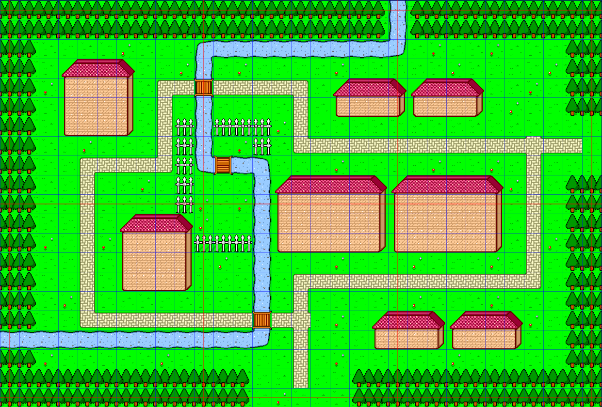

この記事は [WWA Advent Calendar 2024](https://adventar.org/calendars/10185) の21日目です。

WWA Wing v3.5.7 以降ではゲームのアップデートが発生したとしても、ワールド名と暗証番号が変わらなければ、同じセーブデータを活用することができます。詳細については以下のブログ記事からどうぞ。

[WWA Wing v3.5.7 をリリースしました。](/improve-save-data-compatibility/)

ただし、 WWA のセーブデータはゲームのアップデートに適用した形式になっていません。理由は色々ありますが、 WWA のセーブデータはイベントでパーツが置き換わった場合、どこどこの場所にそのパーツが置かれたとか、消えたとかが記録されています。大胆な変更をすると、既存のセーブデータではバグを起こして進行不能になる場合があるからです。


そこで、もし今後アップデートをするとした場合、何を配慮すればいいのか、そしてまだ公開していない段階では、何を気を付ければよいのかを知見として集めました。

- より分かりやすい解説にするため、 WWA Wing ブログとしては違った方向のテンションで書いています。予めご了承ください
- 制作経験上、筆者 (Aokashi) 制作の WWA ゲームの事例が多めに出ます
- 制作するゲームジャンルによって、他にも色々出てくるかもしれません。ほかにも「これは気を付けたほうがいい！」みたいなことがありましたらご連絡ください

目次はこのブログシステムの都合上ありません。すみません。内容は下記の通りでお送りします。

- 初級 バグ修正編
    - イベントで消えたり変わったりする可能性のあるパーツを動かさない
    - 物体パーツの移動属性はなるべく変えない
    - 既存のアイテムパーツを別のパーツに変更しない
    - アイテムボックスの格納位置を変えない
    - 通行可能範囲を削らない
- 中級 機能追加編
    - アイテムの入手でパーツが変わる場面では、条件分岐や床パーツでパーツを差し替えるようにする
    - 変数を新しく設ける場合は、ない場合の処理も考慮する
- 公開前制作編 (基本)
    - マップの構成は公開までには完成しておく
    - アイテムボックスの配置は公開までには決めておく
    - アップデートで変更が入りやすい箇所はセーブ禁止にしておく
- 公開前制作編 (上級)
    - ゲームの進行状況をなるべく変数に記録する

## 大前提

**これから説明するルールに絶対に従う必要はありません**。 既存のセーブデータが壊れることを危惧してバグを修正しないのは元も子もないので、こういう時は壊れることを承知の上で修正したほうがいい場合もあります。

細かい修正をしただけで既存のセーブデータが進行不能になる・・・と言うのであれば少し修正方法を考えたほうが良いと思いますが、ゲームが進行できないバグについては既存のセーブデータが壊れるよりもとにかく修正することを優先しましょう。

こうしたバグ検証を行うには、ゲームの規模によっては WWA Wing のセーブデータ4枠に収まらない可能性があります。ゲーム公開前後では、定期的にパスワードセーブとしてテキストファイルに記録することをおすすめします。

そして、**作ったWWAゲームに機能追加は原則しない**という考えに改めるのも一つの手です。

WWAのセーブデータはアップデートに適用した形式になっていないと言いましたが、個人的な経験からすると、こうした仕様で悩ませるのは「[英棟市](https://www.aokashi.net/wwa/eito_city/)」といった新規要素の追加によるアップデートです。

アップデート対応をバグ修正だけに留めておいて、新しい要素があったら新規に作るWWAゲームに集中する。いいじゃないですか、単発のWWAを複数投稿するという点では、ワールドとワールドを繋げるWWAの理念に合致すると思います。

## 初級 バグ修正編

### イベントで消えたり変わったりする可能性のあるパーツを動かさない

ゲーム中に「ここから先は通せないよ！」みたいなキャラクターがあったとします。


そして、条件によって消せる場合があるとします。


*通れた～ここまでに何時間かかったんやら・・・*

何らかの都合でそのキャラクターを動かしたくなるかもしれませんが・・・。


*あ、やっぱ上にずらしたほうがしっくり来るな～移動しとこ*

すでに通せる状態のセーブデータでこれをやると、通れなくなってしまいます。


*あれぇ！？*

モンスターパーツも、戦闘に勝つと消えるようになっているので、ダンジョンWWAを修正する際はモンスターの配置はあまりいじらない方が良いでしょう。

`$parts` マクロによるパーツの置き換えや消去も対象です。例えばWWAの作成ツールを起動すると出てくる Standard Map のサンプルですが・・・。


実行すると以下の座標にあるパーツが削除されたと記録されます。

- X: 63, Y: 12
- X: 65, Y: 12
- X: 63, Y: 14
- X: 65, Y: 14
- X: 63, Y: 16
- X: 65, Y: 16
- X: 63, Y: 18
- X: 65, Y: 18

### 物体パーツの移動属性はなるべく変えない

こういう「うろうろする」のキャラクターがいたとします。


この状態でセーブする人もいるかもしれません・・・。


う～ん、うろうろするのは鬱陶しいから静止に変更！ としたくなる場合がありますが・・・。


塞がれてしまう場合もあります。


？？？「ここから先どこにも行けない！」

今回の例はカウンターのある部屋としましたが、ダンジョンWWAにおいてはこれが致命傷になる場合もあるため、慎重に行いましょう。

逆に「静止」から「うろうろする」に変更とした場合は大きな影響は受けないでしょう。ただし「プレイヤー追尾」や「逃げる」に変更したとした場合、今度はゲームバランスの問題も付きまとうので注意が必要です。

なお、パーツの通行区分が「通り抜け可」とした場合はその限りではありません。

### 既存のアイテムパーツを別のパーツに変更しない


WWAに詳しい人ほどわかるような話ですが、セーブデータでは、アイテムのパーツ番号を元に記録しているため、これも見過ごせません。

セーブデータで持っているアイテムがアイテムではなくなります。

「そもそもアイテムから別のパーツに変えることはそんなにないやろ！」と思うかもしれませんが、既存の WWA の改修の際に、変数機能や WWA Script を活用して、鍵を複数持たせたりしたい場合はその場面が出てくるかもしれません。

### アイテムボックスの格納位置を変えない

武器や防具、釣竿、ツルハシなど、常時手にするアイテムについては、アイテムボックスへの格納位置を指定することがあります。


*大金をはたいて、釣竿を手に入れたぞ！*


*あれ？ 釣竿を11番に入れてしまった。あれは武器を置く場所だから、9番に移動しよう。*


*次は武器の入手だ、待ってろよ！*


*武器を手に入れ・・・あれ？ 釣り竿が変な位置に行ってしまった！*

アイテムボックスの格納位置を指定しているアイテムを入手して、すでにその格納位置にアイテムがある場合は、以下の通りの挙動となります。

- その既存のアイテムの「アイテムボックスの格納位置」が異なる場合は、適当な空いているアイテムボックスに移動します。
    - 今回のケースはこれに該当します。
- その既存のアイテムの「アイテムボックスの格納位置」が同じ場合は、入手したアイテムに上書きされます。

さほど大きな問題ではないですが、追い出されたアイテムは記載したアイテムボックスの格納位置通りに格納してくれないため、バグの原因になるかもしれません。

### 通行可能範囲を削らない

こんな感じの部屋があったとします。


*セーブする時は端っこ大好き！ 隅っこが落ち着くんだ*

大きすぎるな・・・小さくするか。とか、何か物でも置くか。とか、思うはずです。


*ちょっと部屋が広すぎたな・・・狭くしとくか*

ただし、置き方次第では最悪プレイヤーが移動できなくなる場合があります。


*あああああああああ！！！*

もし削るにしても、周囲1マスぐらいに留めておくことをおすすめします。そうすれば隣の床に脱出することは可能です。

## 中級 機能追加編

基本は以上のバグ修正編だけを意識すれば多分トラブルにはなりにくいと思います。

しかし修正の仕方次第では以下の対応をしなくてはいけない場合もあったりします。

### アイテムの入手でパーツが変わる場面では、条件分岐や床パーツでパーツを差し替えるようにする

以下のように条件でパーツが変わるキャラクターを作る場合は注意が必要かもしれません。

- 普通は通常の斧を販売する
    
    
    
- 通常の斧を購入すると、今度は金の斧を販売する
    
    
    

アイテムも併せて新規追加するんだったら、別に関係ない話なので、結構レアケースかもしれません。ただし、後のアップデートで、以下のことが起こるかもしれません。

- より安い価格で斧を売るパーツをどっかに置きたい・・・
    
    
    *次回アップデート！ なんと奥地まで行ったあなたには、サービス付きで斧を販売してくれます！*
    
- ゲームバランスの都合で斧を売るパーツを移転しなくてはいけない・・・

すでに通常の斧を持っている場合は・・・？


*いや～次のアップデートで金の斧がおトクに買える販売がいるのか～。頑張って通常の斧は手に入れたぞ*

通常の斧の買い直しに迫られます。これはいけない。


*え？ また通常の斧を買えと言うんですか？？？*

こうした場合ですが、 WWA Script が使用可能であれば、すでに斧を持っている場合の考慮もできます。


```javascript
<script>
// 通常の斧を持っている場合は
if (HAS_ITEM(17)) {
  // 金の斧販売パーツに誘導する
  o[PX][PY] = 22;
} else {
  // 持っていない場合は、通常の斧販売パーツにする
  o[PX][PY] = 21;
}
```

その他の環境においては、「道」パーツの反応するアイテム番号くらいしかありません。


そしてこの道パーツを販売パーツの周辺に置いておきましょう。 WWA Script で判別できる場合は、この道パーツを設ける必要はありません。


*金の斧がよりおトクに買えるぞ・・・！*

過去の事例として、WWAゲーム「英棟市」のアップデートで、ツルハシの販売場所を移転することになった場合のことを説明します。

- 販売パーツをそのまま移動すると、金のツルハシを持っているのに、移転後の場所では金のツルハシが販売されています。ダイヤモンドのツルハシが欲しいのに一度金のツルハシを買わなくてはいけません。
- そうなった場合のために、販売フロア入り口の床パーツで金のツルハシを持っている場合はダイヤモンドのツルハシの販売パーツを置くように対応しました。
    
    
    
- 変数機能や WWA Script が使用可能であれば、 if 文で判別したほうが手っ取り早いです。上記のパーツを WWA Script に書き換えると以下の通りとなります。
    
    ```javascript
    <script>
    if (HAS_ITEM(629)) {
      o[394][382] = 1508;
      o[398][382] = 1513;
      m[PX][PY] = 771;
    }
    ```
    

### 変数を新しく設ける場合は、ない場合の処理も考慮する

変数機能や WWA Script を活用した場合の話になります。

```javascript
<script>
// スコアを加算する処理。なければ 0 に初期化する。
if (!v["score"]) {
  v["score"] = 0;
}
v["score"] += 100;
```

- 現在の WWA Wing 不安定版では名前付き変数が使用可能で、 `v["score"]` が未定義かどうかを確認する条件を `!v["score"]` としていますが、今後のバージョンアップで変わる可能性があります。
    - その辺が気になるようであれば、名前付き変数の代わりに0～255番の番号付き変数の使用がおすすめかもしれません
- このように、前のデータを新しいデータ形式に更新する作業のことを「マイグレーション」と言います
- WWA Script では CALL_QUICKLOAD 関数あるいは CALL_PASSWORD_LOAD 関数で、セーブデータからロードした場合に実行されるイベント関数が設定できます。QuickLoad とパスワードロードでイベント関数は別々のため、以下のようにマイグレーション処理をユーザー定義関数にまとめると良いでしょう。
    - 工夫すれば、バッグやファストトラベルなどのツール関連のアイテムをアップデートで追加した場合、既存のセーブデータにも追加することができるようになります。

```javascript
function migrate() {
  if (!v["score"]) {
    v["score"] = 0;
  }
}

function CALL_QUICKLOAD() {
  migrate();
}

function CALL_PASSWORD_LOAD() {
  migrate();
}
```

## 公開前制作編 (基本)

公開する前なら、まだプレイヤーのセーブデータは作られていません。

事故る前に、しっかり対策しよう！

### マップの構成は公開までには完成しておく



街の広さはこうして～、ここに建物があって～、と言った設計は公開までにはちゃんと完成しておきましょう。

後で大きな変更が発生した場合、既存のセーブデータで読み込むと闇の中に吸い込まれたり、壁の中にいたりするかもしれません。

### アイテムボックスの配置は公開までには決めておく


マップの構成ときたらアイテムボックスも決めておいた方が良いでしょう。

10番には武器、11番には防具、12番にはメニュー画面を呼び出すバッグアイテム・・・という感じでどこかにメモ書きしておくとおすすめです。

制作前段階であれば、 [Eden](https://plicy.net/GamePlay/164684) みたいに消費アイテムをアイテムボックスに置かないようにしたり、 [DCE](https://plicy.net/GamePlay/187184) みたいにそもそもアイテムの概念を持ち込まないようにして割り切るのも一つの手だと思います。

### アップデートで変更が入りやすい箇所はセーブ禁止にしておく


例えばコマンドバトルやミニゲームなど、別画面に移動して複雑な処理を起こすとかについては、セーブ禁止にしておくと良いでしょう。

ケチのように思うかもしれませんが、場合によってはロードによるガチャ狙いを防ぐことができることがあるため、そこまで悪いことではないと思います。

これであれば、セーブ禁止の範囲内ならパーツ配置の微調整をしたり、自由に新しい変数を考えたりしても構いません。ただし、ボスバトルで勝った数など、セーブ可能領域に越えて使用される変数は別で、あとから定義しても既存のセーブには含まれません。

## 公開前制作編 (上級)

WWA Script に変数を記録することで、今後のアップデートでカバーできるかもしれません。

### ゲームの進行状況をなるべく変数に記録する

既存のセーブデータで条件分岐が効きます。

例えばファンタジーアイランドにおいて、アイテムショップ「ミシュラン」に大猫がいます。イカダで対岸の島へ移動した場合は、その大猫のセリフを変えるようにしましょう。

普通なら以下のようにするはずです。

1. セリフが変わった後の大猫のパーツを新規作成する
    
    
    
2. 対岸の島に移動するイカダのパーツにて、その大猫のいる座標に作成したパーツを配置するように変更する
    
    
    

しかし公開後にその必要が出たらどうしましょうか？ もちろんこの対応でできると思いますが、それ以前に遊んだ人はその変わったセリフを見るにはもう一度遊び直さなくてはなりません。もう一度イカダで対岸の島に渡れば済むような話ですが、今回はこれがイベントシーンだと通用しなくなるので、このことは忘れておきましょう。

公開前だとした場合、こうした事態に備えて、以下のように対応するのはいかがでしょうか？

1. イカダで対岸の島に移動したと分かる変数番号をあらかじめ決めておく
    1. 今回は  33 としましょうか
2. 対岸の島に移動するイカダのパーツを変更。「ジャンプゲート」から以下のテキストを持つ「メッセージ」に変更する
    
    
    
    ```javascript
    <script>
    v[33] = 1;
    JUMPGATE(54, 57);
    ```
    

これで準備完了です。もし必要になったら、このように修正すればいいのです。

1. 大猫の物体パーツを編集し、以下のテキストに変更する
    
    
    
    ```javascript
    <script>
    if (v[33] > 0) {
      MSG(`対岸の島にはモルガン
    の村があって、魚を
    あげるとすごいもの
    をくれるらしいのニャ。`);
    } else {
     MSG(`アイテムを買うときは、
    何をどの順番で買うか、
    よく考えてからにするべきだニャ。`);
    }
    ```
    
    
    

今後対岸の島に移動したらセリフが変わるキャラクターが必要になっても大丈夫！


倒したモンスターの種類、鍵で扉を開けた回数、最後使用したアイテムの場所などなど・・・色々なイベントを変数に記録しておくといいですね。副次的な効果としてゲームクリア後の統計情報の表示にも活用できるかもしれません。

過去の事例として、WWAゲーム「[謎めいた機械を追い求めて 闇組織の争奪](https://www.aokashi.net/wwa/strange_machine_next/)」については後のアップデートで仲間キャラクターの解説が含まれる「思い出の記録」を追加したことについて説明します。


- 「思い出の記録」は主人公の切り替わりイベントや節目となるイベントが終わると、仲間キャラクターに関する情報が追加されます
- すでにゲームの章やボスモンスターを倒した記録は変数やマップ配置から特定できたため、「思い出の記録」を開いた時にその情報を基に仲間キャラクターの情報を配置する仕組みを取りました（以下のソースコードを参照）。
- これにより、「思い出の記録」追加前にクリアしたセーブデータでも、仲間キャラクターの解説が含まれるようになります。
- ただしこれでも不完全で、より正確に実現するのであれば、各仲間キャラクターが登場したかフラグを設ける必要があります。

```javascript
/**
 * 思い出の記録の内容を更新します。
 * 思い出の記録はゲーム公開後後付けで追加されたため、既存のセーブデータにおいては、イベント変数から判別して自動で追加するようにしています。
 */
function updateCharactersBook() {
  v[201] = 143;
  v[202] = 422;
  // マサト
  o[v[201]][v[202]] = 1152;
  o[v[201]][v[202] + 1] = 33;
  if (v[19] >= 1) {
    // ケダキ
    o[v[201] + 1][v[202]] = 129;
    o[v[201] + 1][v[202] + 1] = 2825;
    // ジュニアー
    o[v[201] + 2][v[202]] = 1153;
    o[v[201] + 2][v[202] + 1] = 189;
  }
  if (v[19] >= 2) {
    // ミチジル
    o[v[201] + 3][v[202]] = 1843;
    o[v[201] + 3][v[202] + 1] = 2751;
    // ヤツロウ
    o[v[201] + 4][v[202]] = 627;
    o[v[201] + 4][v[202] + 1] = 2750;
  }
  // ブレーキに勝つと追加される
  if (v[132] > 0) {
    // コウハク
    o[v[201] + 5][v[202]] = 596;
    o[v[201] + 5][v[202] + 1] = 2826;
  }
  // 以降省略
}
```

## 最終手段

暗証番号あるいはワールド名を変更してしまいましょう。


セーブデータが消滅するため、本当の最終手段です。


*😇*

## まとめ

- WWAのセーブデータはマップの差分でできている
- イベントで変わったりするパーツは動かさない、通行可能範囲は削らない
- 変数を活用する場合は、変数がない場合の考慮が必要
- 変更が発生しやすい場面ではセーブ禁止にしておくのもアリ

大前提で言いましたが、これらのルールを守ると進行不能バグが直せない！ ようであれば、修正を優先しましょう。セーブデータを守りつつ修正するというのは結構高度なテクニックかもしれません。

この記事は [WWA Advent Calendar 2024](https://adventar.org/calendars/10185) の一環として制作しています。次回の記事は池田哲次さんの「ブラウザ上で効果音を作れるツールjfxrの紹介」です。

### パスワードバンクの存在

継続アップデートを前提とするWWAは昔からありました。代表例がヒラリラーさん作の「[24LIFE](https://hirarira.net/wwa/24life/)」です。

このゲームは「英棟市」と同じくプレイヤーがゲーム上に登場させる「永住登録」と言う仕組みを採用していて、継続的なアップデートを必要としています。

しかし当時のWWAはアップデートをすると今まで保存していたパスワードセーブは無効になってしまいます。せっかく稼いだ金が水の泡になってしまうのは勿体ない・・・その時代に発明されたのが「パスワードバンク」という施設です。


WWAの仕掛けで暗証番号をゲーム制作者が設定し、プレイヤーはそのパスワードバンクでお金を預けることで暗証番号が分かるようになります。アップデート後、その暗証番号を使用してお金を引き出すことができるというわけです。
