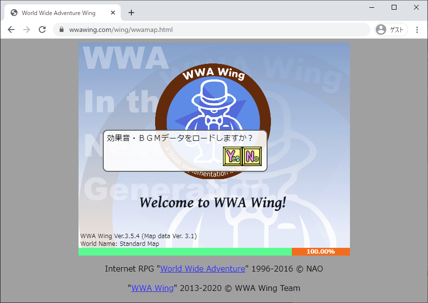

- この記事は以前 [WWA FanSquare](https://www.wwafansq.com) のコラムで公開していた記事を WWA Wing ブログに移行したものを再度編集したものになります

こんにちは。 WWA Wing Team です。今回は特集として、 WWA ゲームをホームページに公開するにはどうしたら良いのか方法をまとめました。

WWA ゲームを投稿する方法として一番簡単なのは、 [PLiCy](https://plicy.net) でゲームを投稿することなんですが、メンテナンスによって PLiCy が一時的に使用できない場合は、代わりの方法も検討しなくてはなりません。



そこで、 **自分でレンタルサーバーを借りてその中に WWA ゲームを設置する** 方法をお伝えします。

WWA は元々、ホームページに設置して他人のホームページの WWA ゲームと URL ゲートでつなげることで楽しむことができましたから、ホームページに公開する方法も楽しいですよ！

なお、今回は WWA ゲームを公開することを目的としていますので、下記の内容は含まれていません。

- WWA ゲームそのものの制作方法
- ホームページの装飾方法
    - ホームページというと、自分の自己紹介や興味のあるコンテンツなどが含まれているイメージがありますが、今回はそれらの作成方法は割愛します

今回の紹介にあたっては、下記の環境を使用しています。

- OS: Windows 10 Pro (2004)
    - Windows 10 Home でも同様に操作出来るはずです
    - 予め拡張子は表示するように設定しておく必要があります
- ブラウザー:
    - Google Chrome 84.0.4147.125
    - Firefox 79.0
- テキストエディター: メモ帳
    - 今回は手順を簡単にするために Windows 10 付属のメモ帳を使用していましたが、問題発生時の原因究明をしやすくするために、インターネットから入手出来る多機能のテキストエディターをおすすめします

## ホームページに置くメリット
PLiCy で WWA ゲームを投稿する時と比べて優位な点は下記の通りです。

- アップロードから反映までの時間が速い
- WWA ゲームの装飾ができる
- 起動オプション `data-wwa-***` の設定が可能
    - 古い WWA ゲームの再現で使用するクラシックモードや、BGM の切り替えに使用していた URL ゲートの無効化などが設定できます
    - どんなオプションが存在するかは [WWA Wing のマニュアル](https://wwawing.com/wing/manual.html) からどうぞ

逆に、設置の手軽さやゲームプレイの共有のしやすさでは PLiCy で WWA ゲームを投稿したほうが優れています。すでにホームページで WWA ゲームを設置している人でも、自信を持っておすすめできる WWA ゲームでしたら PLiCy に投稿しても良いでしょう。

## WWA ゲームを公開する


まず、 WWA ゲームをホームページに公開するには、下記が必要になります。

- **WWA ゲームをプレイする各種ファイル** → 1. WWA ゲームを手元の PC で遊べるようにする
- **ホームページを置く場所** (レンタルサーバー) → 2. レンタルサーバーを借りる

### 1. WWA ゲームを手元の PC で遊べるようにする

ホームページ作りを行う前に、手元の PC で WWA ゲームを遊べるように整えておきましょう。というのも、テストプレイの度に PLiCy にアップロードするのでは、アップロード完了までに時間がかかります。

手元の PC で遊べるようにするには、大まかには下記のファイルが必要です。

- `XXX.dat` ... 制作している WWA のマップデータ
- `XXX.gif` ... 制作している WWA のイメージ画像
- `XXX.html` ... 制作している WWA の実行ファイル
- `cover.gif` ... WWA Wing 起動時に表示されるカバー画像
- `wwa.js` ... WWA Wing 本体
- `wwa.css` ... WWA Wing 本体のスタイルシート
- `style.css` ... 実行ファイルのスタイルシート
- `wwa-server.exe` ... 制作した WWA ゲームをテストプレイする際に実行するプログラム

このうち、上3つは自分で作成することになりますが、下5つは WWAWing の完全版を入手することで取得できます。

#### 1.1. WWA Wing を入手する
まずは、作成環境を作るために WWA Wing を入手しましょう (特にキャラバンサークルから配布されている WWA マップ作成ツールを使い続けている場合)。

1. まずは、 WWA Wing の完全版を入手しましょう。 [WWA Wing](https://wwawing.com) からページ上部の「完全版」でダウンロードすることができます。
2. 入手した WWA Wing の完全版の zip ファイルを展開します。ファイルを右クリックして「すべて展開」を選び、適当なフォルダーにファイルを展開させます。
    - ・・・と、ここまでは WWA ゲームを制作した人にとってはもうとっくに分かっていますよね。
    - ちなみに、自分では「展開」ではなく「解凍」と言ったりしています。
3. `2.` で展開したファイルの中から、下記ファイルを取り出します。
    - `cover.gif`
    - `style.css`
    - `wwa.js`
    - `wwa.css`
    - `wwa-server.exe`

#### 1.2. HTMLファイルを作成する


制作している WWA の実行ファイルになる HTML ファイルを作成するには、下記の手順を実行します。

1. 制作している WWA のマップデータと同じフォルダーでテキストファイルを作成します。
    - 作成方法については上図のように右クリックのコンテキストメニューから「新規作成」→「テキスト ドキュメント」で作成し、ファイル名を入力すると簡単にできます。
    - ファイル名は WWA のマップデータと同じファイル名にすることが普通です。
    - 例えば `samplegame.dat` を読み込む HTML ファイルであれば `samplegame.html` とします。
    - ファイル名の末尾は必ず `.html` にしてください (でないと正しく動きません)。
2. `1.` で作成したテキストファイルを編集し、下記のテキストをそのままコピーして貼り付けます。
    - 編集については、右クリックのコンテキストメニューから「プログラムから開く」→「メモ帳 (あるいは適切なテキストエディター)」でできます。
3. `(マップデータファイル名)` を制作している WWA のマップデータファイル名に差し替えます。
    - 差し替えの際は拡張子の `.dat` も忘れないようにしましょう。

```html
<!DOCTYPE html>
<html lang="ja">
  <head>
    <meta charset="UTF-8">
    <title>World Wide Adventure Wing</title>
    <link rel="stylesheet" href="style.css"/>
    <!-- wwa requirements-->
    <link rel="stylesheet" href="wwa.css"/>
    <script src="wwa.js"></script>
    <!-- /wwa requirements-->
  </head>
  <body>
    <div id="wrapper">
      <div class="wwa-size-box" id="wwa-wrapper" data-wwa-mapdata="(マップデータファイル名).dat" data-wwa-urlgate-enable="true" data-wwa-title-img="cover.gif"></div>
    </div>
    <footer id="copyright">
      <p>Internet RPG &quot;<a class="wwa-copyright" href="http://wwajp.com/">World Wide Adventure</a>&quot; 1996-2016 &copy; NAO</p>
      <p> &quot;<a class="wwa-copyright" href="https://wwawing.com/">WWA Wing</a>&quot; 2013-2020 &copy; WWA Wing Team</p>
    </footer>
  </body>
</html>
```

ファイルの編集が必要になるのでここで難しく感じると思います。インターネットの検索で学んだりして進めていきましょう。

#### 1.3. wwa-server を実行する
WWA ゲームを動かす下準備ができました。 WWA Wing の一式から入手した `wwa-server.exe` を実行してみましょう。

実行すると、下記のように SmartScreen の警告が表示されますが、本プログラムに有害なものは含まれていません。中程の「詳細情報」→右下の「実行」を順番にクリックします。


- 前述のような警告を表示しないようにしたいところなんですが、デジタル証明書の取得が必要で、これがかなり高価だったりするんです・・・

そして次には下記のように Windows セキュリティからファイアウォールの許可をたずねるウインドウが表示されますが、「キャンセル」をクリックしても構いません。許可をすれば、スマートフォンでの動作確認が出来るといった便利な面はありますが、下手をすると制作中のゲームが他人から見られるリスクがあります。


すると、黒い画面が表示されますが、閉じずにそのままにしておきましょう。

ここで Web ブラウザを立ち上げて、 `localhost:3000/(1.1. で作成した HTML ファイル)` にアクセスします。どのようにアクセスすればよいのか分からない場合は、下図のファイル構成を参考に、アクセスする URL を探してみて下さい。

```
wwawing-dist
|- example.html → wwa-server.exe を動かさないと無理です...
|- WinWwamk.exe
`- mapdata
   |- wwa-server.exe
   |- samplegame.html → localhost:3000/samplegame.html
   `- example
      `- wwagame.html → localhost:3000/example/wwagame.html
```

#### 1.4. 確認
これで問題がなければ、ファイル構成は下記の通りとなっていると思います。


- `wwamap.dat` と `making.gif` が残っているのは、 WWA マップ作成ツール起動時の画像ファイルが見つからないエラー表示を防ぐためです。

もし `wwa-server.exe` を使用してテストプレイしても、うまく動かない場合は、ファイル構成や実行ファイルに間違いがないか確認しておきましょう。

### 2. レンタルサーバーを借りる


さて、前述でアクセスできた `localhost:3000/...` というアドレスですが、これをインターネットで公開しても誰も遊んでくれません。みんながアクセスしても上図のようにエラーが表示されます。

そもそも `localhost` というのは、自分の PC に対して参照するアドレスですので、みんなからアクセスしてもみんなの PC の中を参照しようとしていることになっています。

そこで、みんなから遊んでもらえるように、レンタルサーバーを借りましょう。

#### 2.1. おすすめのレンタルサーバー
レンタルサーバーを提供しているサービスはいくつかありますが、レンタルサーバーが違うとこのあとの操作方法が違ってきます。

- [スターサーバー フリー](https://www.star.ne.jp/free/)
    - 広告を表示したくないのであれば **フリー**
    - PHP を使用したプログラムを設置したいのであれば **フリー PHP+MySQL**
- [XREA Free](https://www.xrea.com/)
- [FC2 ホームページ](https://web.fc2.com/)

昔はレンタルサーバーを提供しているサービスは結構ありましたが、 SNS の普及に伴いわざわざホームページを持つ必要がなくなったために、提供を終了したり、提供していてもサポートを放棄しているサービスがあったりします。

有料ではありますが、下記のサービスも存在します。実績のあるサービスですので、長期的な使用でも安心です。

- [ロリポップ！](https://lolipop.jp/) (100円/月)
- [さくらのレンタルサーバー](https://www.sakura.ne.jp/) (131円/月)

レンタルサーバーを借りる方法については、各サービスのサイトからご確認ください。

#### 2.2. ホームページ作成サービスとは違うのか？
WIX や Jimdo のような簡単にホームページが作成できるサービスがありますが、 **WWA ゲームを設置することはできないので避けましょう。**

というのは、 WWA を設置するに必要な外部ファイルのアップロードや JavaScript プログラムの呼び出しができないためです。

(まあ、頑張ればできなくは無いですが・・・ WWA の仕様上面倒な展開になると思うので避けたほうが無難です。)

ここで **レンタルサーバー** と言ったのは、 WWA ゲームが設置できないホームページ作成サービスとの混合を避けるためです。

### 3. WWA ゲームを公開する
ひとまず、自分の WWA ゲームを公開することがゴールであれば、これが最後です。

#### 3.1. ファイルのアップロードをブラウザで操作する
この手順は提供しているレンタルサーバーのサービスによって異なります。先程挙げたレンタルサーバーのサービスでは、下記の手順でたどり着けます。

どのレンタルサーバーも実際に契約していないため、アクセス方法には間違いがあるかもしれません。

(2020年8月4日現在)

- **スターサーバー**
    1. スターサーバーのサイトのメニューにある「ログイン」から「ファイルマネージャー」を選択
    2. アカウント情報を入力してログイン
- **XREA**
    1. XREA のサイトから右上にある「ログイン」でアカウント情報を入力して新コントロールパネルに移動
    2. 新コントロールパネルの左サブメニューの「サイト設定」からサイトのURLを選択
    3. 左サブメニューをスクロールすると net2ftp ファイルマネージャー のボタンがあるのでそのボタンをクリック
    4. `public_html` → `(サイトのURL)` でフォルダーを選択
- **FC2ホームページ**
    1. FC2ホームページのサイトにある「ログイン」でアカウント情報を入力して管理画面に移動
    2. 左側のメニューから「ファイルマネージャー」を選択

上記以外のレンタルサーバーをご利用の方は、契約しているレンタルサーバーのヘルプページをご参照ください。ものによっては、 **FTPソフトの導入** が必要になる場合があります。

#### 3.2. ファイルをアップロードする
先程開いたファイルマネージャーを使用して、 WWA ゲームをアップロードします。

下記のファイルをファイルマネージャーでアップロードしましょう。

- audio
    - XXX.mp3
- (ゲーム).dat
- (ゲーム).gif
- (ゲーム).html
- cover.gif
- style.css
- wwa.css
- wwa.js

(`wwa-server.exe` はアップロードする必要はありません。)

前述のファイル構成の中からアップロードすべきファイルを示すと下図のようになります。


#### 3.3. アクセスしてみる
アップロードが終わりましたら、 `(サイトのURL)/(ゲーム).html` でアクセスしてみましょう。

これでただしくアクセスできて、WWA ゲームが動作できたら成功です。おめでとうございます！

#### 3.4. おかしい？
アクセスしてみて正しく動かなければ、下記を参考に疑ってみましょう。

- 404 Not Found と出ている
    - `(ゲーム).html` はアップロードしましたか？
    - アクセスしているファイル名を間違えていませんか？
- WWA ゲームの画面が表示されない
    - `wwa.js` はアップロードしましたか？
- WWA ゲームの画面が乱れている
    - `wwa.css` はアップロードしましたか？
- 背景が白い、 WWA ゲームの画面が中央に寄ってない
    - `style.css` はアップロードしましたか？
- **マップデータ「XXX.dat」が見つかりませんでした** と表示された
    - `(ゲーム).dat` はアップロードしましたか？
- **画像ファイル「XXX.gif」が見つかりませんでした** と表示された
    - `(ゲーム).gif` はアップロードしましたか？
- 音がでない
    - サウンドファイルはアップロードしましたか？
    - サウンドファイルを入れているフォルダー名は `audio` になっていますか？

### 4. 2作目以降は？
別の WWA ゲームをホームページに公開する際は、下記の手順を踏む必要があります。

1. `1.2.` HTMLファイルを作成する
2. `1.3.` wwa-server を実行する
2. `3.` WWA ゲームを公開する

## もっとステップアップしてみよう！
WWA ゲームをホームページに公開したら、下記も試してみましょう。

- ホームページテンプレートからホームページを制作する
- WWA ゲームの一覧ページを制作する
- WWA ゲームの設定資料を書く

## 最後に
これまで説明したように、 WWA ゲームをホームページで公開するには、実行ファイルを用意して、レンタルサーバーを借りて、ファイルをアップロードして、・・・と面倒な手順を踏むことになります。

PLiCy を利用すれば、ファイルを zip ファイルにまとめて投稿するだけで済みます。ネットショッピングを設営する際に自分で設営するか、設営サービスで作った作品を送るかぐらいの違いがあります。

とは言え、実際にホームページに設置してみて、 WWA の原点を味わってみるのもどうでしょうか？

- 2020年9月3日追記: 誤字の修正とテキストファイルの編集方法、 PLiCy のサービス再開の追記をしました。
