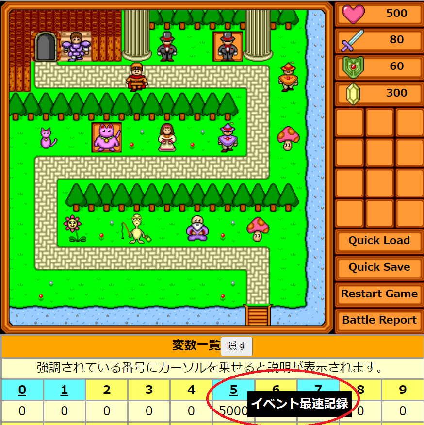
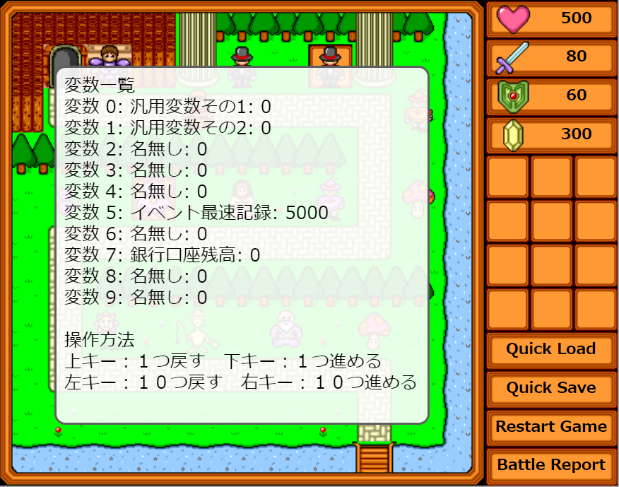

WWA Wing Team です。

WWA Wing v3.7.0 をリリースしました。(その後不具合修正を行ったため、当ブログ執筆時点での最新バージョンは v3.7.1 となっています。) v3.6.0 よりユーザ変数を扱えるようになりましたが、どの変数を何に使っていたかわかりにくくなった経験はありませんか？今回のリリースでは、開発中に変数の中身を見る機能の強化を行い、あらかじめ名前をつけた変数の名前を値とともに表示することができる機能を追加しました。

## 従来の変数一覧での表示方法
まずは、[完全版をダウンロード](https://github.com/WWAWing/WWAWing/releases/latest/download/wwawing-dist.zip)して、 `mapdata/wwamap.html` (スタンダードマップ) を wwa-server を立ち上げた状態で、 [http://localhost:3000/wwamap.html](http://localhost:3000/wwamap.html) から、ブラウザからアクセスしてみてください。



画面下部の「変数一覧」を見てください。水色で強調された背景で示された番号の変数が「名前をつけられた」変数です。この変数の番号にカーソルを合わせると、変数の名前が表示されます。

## ゲーム画面中の変数一覧の表示方法
また、ゲーム中の画面でも変数の一覧を確認できるようになりました。ゲーム起動中に、キーボードの【**V**】を押してください。



このように、ゲーム画面中でも、名前つきで変数一覧が確認できるようになりました。上下左右のカーソルキーで変数の表示範囲を変更できます。

## 変数名の表示方法
では、これらの変数の名前の設定方法について見ていきましょう。完全版配布物の `mapdata` フォルダ中に `wwamap-vars.json` というファイルを開いてみましょう。

 ```json
 {
  "変数番号": "説明",
  "0": "汎用変数その1",
  "1": "汎用変数その2",
  "5": "イベント最速記録",
  "7": "銀行口座残高",
  "この行は消さないでください": ""
}
 ```

 このように、変数の番号と変数の一覧が縦にたくさん並んでいます。どれかの行をコピーして貼り付けて、名前をつけたい変数の説明の番号を並べて書いていきましょう。

 ```json
 {
  "変数番号": "説明",
  "0": "変数0番の説明",
  "1": "変数1番の説明",
  "2": "変数2番の説明",
  "253": "りんご",
  "254": "ごりら",
  "255": "らいおん",
  "この行は消さないでください": ""
}
 ```

変数の番号の順番は、下記のように前後しても大丈夫ですが、小さい順に並べた方が管理しやすいでしょう。

```json
{
  "変数番号": "説明",
  "253": "りんご",
  "254": "ごりら",
  "255": "らいおん",
  "0": "変数0番の説明",
  "1": "変数1番の説明",
  "この行は消さないでください": ""
}
 ```

また、 `:`, `"`, `,`, `{`, `}` などの記号を消してしまうと、ゲーム起動時にエラーになってしまうことがあります。
エラーになった場合でもゲームは続行でき、変数一覧も表示できるのですが、すべての変数が「名無し」扱いとなってしまいます。

## 自作のゲームで名前つき変数を使うには

変数一覧表示を有効にするには `data-wwa-display-user-vars` 属性に `true` を与えてください。ゲームを Web上に公開する時は、この属性を忘れずに消去してください。この属性が指定されていない場合は、【V】キーの変数一覧も、画面外の変数一覧も表示されなくなります。

例えば、

- 変数一覧表示有効
- 変数名一覧ファイル `sugoi-game-vars.json`
- 画面外の方の変数一覧を表示

という設定は、下記のHTMLのコードで実現できます。

 ```html
 <div
  class="wwa-size-box"
  id="wwa-wrapper"
  中略
  data-wwa-var-dump-elm="#vardump"
  data-wwa-user-var-names-file="sugoi-game-vars.json"
  data-wwa-display-user-vars="true">
</div>
```

また、`data-wwa-user-var-names-file` 属性を使って、作成した変数の名前リストのファイル (拡張子 `.json`) を指定してください。

`data-wwa-display-vars` 属性が `true` かつ、 `data-wwa-user-var-bnames-file` 属性が与えられない場合は、全ての変数が名無し扱いになります。

ゲーム外の方の変数一覧を表示したくない場合は `data-wwa-var-dump-elm` 属性を削除してください。 

## 過去バージョンの WWA Wing からのアップデートする場合は注意してください
過去バージョンをご利用で、画面外の変数一覧を表示していた場合は、WWA Wing の v3.7.0 以降へのアップデートとともに表示できなくなるので、アップデートした後 `data-wwa-display-user-vars="true"` を忘れずにつけてください。

その他、WWA Wing v3.7.0 では、過去のバージョンと互換性のない変更がいくつかありますので、詳しくは [マニュアル](https://wwawing.notion.site/v3-7-0-3ae7dcd4d56b4b1a8fd3010de840346b) をご覧ください。

今後とも WWA Wing をよろしくお願いいたします。
