前回の記事 [ピクチャ機能入門！ ゲームに便利情報を表示してみよう](/picture-beginner-show-status) の続きです。

これまで情報の表示をしましたが、試しにピクチャ機能の魅力、演出に触れてみましょう。

演出の書き方はいくつかピクチャの定義を書かないと行けないため結構大変ですが、出来上がった時の迫力は自分にとってのご褒美でもあり、他の作品にはない魅力を作る要素にもなります。

- 今回も WWA マップ作成ツール付属のゲームを改造する形での解説になります。
- 今回は応用のため、パーツの編集手順などの基本的なことは含まれません。 WWA の制作に慣れていない方は入門編からご覧ください (慣れていない方にとって入門編でも分かるかどうか怪しいところですが・・・)。

## カニを倒すと沈む演出を加えよう

[ファンタジーアイランド](https://wwajp.com/wwa/island02.html) ではボスのカニを倒すと「ブクブク・・・」のメッセージと共に消滅します。これを沈むような演出にしてみましょう。

まず物体パーツを61番を、以下のメッセージに置き換えます。

```javascript
ブクブク・・・
<script>
PICTURE(1, {
  pos: [160, 200],
  img: [6, 16],
  crop: [2, 1],
  timeFrame: 40,
  move: [0, 1]
});
```

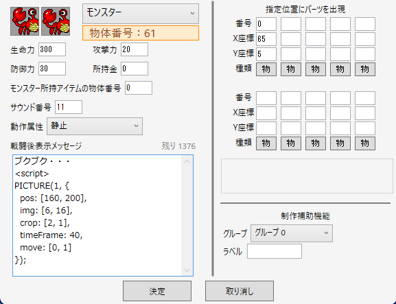

見慣れないプロパティが現れましたね。1つずつ解説します。

- `crop: [2, 1]`
    - ピクチャをイメージ画像の中から横2マスに拡張して表示しますよーと示してます
    - ファンタジーアイランドのカニは横2マスになるので、隣のマスと合体させて横2マスのピクチャとして動かします
- `timeFrame: 40`
    - ピクチャは表示されてから40フレーム後には消えますよーと示す文です
- `move: [0, 1]`
    - ピクチャを1フレームごとに下に1ピクセル動きますよーと示す文です

多少難しい内容はありますが、まずは入力して動かしてみましょう！


下にスーッと移動する感じになってませんか？ 一部を目隠しするピクチャを設けてみましょう。

```javascript
ブクブク・・・
<script>
// ここはそのまま
PICTURE(1, {
  pos: [160, 200],
  img: [6, 16],
  crop: [2, 1],
  timeFrame: 40,
  move: [0, 1]
});
PICTURE(2, {
  pos: [160, 240],
  img: [4, 13],
  repeat: [2, 1],
  timeFrame: 40
});
```

- `repeat: [2, 1]`
    - ピクチャを同じ画像で横に2マス、縦に1マス並べて表示しますよーと示す文です

こうすることで、カニが沈む演出ができました。背景パーツと同じ模様のピクチャを重ねることで実現できました。こうした実現方法を考えるのはアイデアと言うか閃きの問題です。

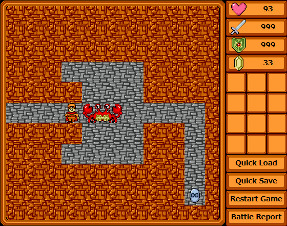

### 動きのあるピクチャを作るには？

以上紹介したピクチャのプロパティをさらっと紹介しましたが、まだピクチャ機能に触れ始めた人にとっては見慣れない要素がいくつかあったと思います。

**フレームってなんだ？**

ゲーム画面、少なくとも WWA では、何かキャラクターの動きが発生するとした場合、その動きを紙芝居的に画面を切り替えています。この切り替えの単位を「フレーム」と言います。

そして今回紹介した `move` プロパティは、フレームの切り替えでどのくらい動かすか、と言うことを示します。

`move` プロパティの移動単位であるピクセルについては画像編集などをしているとある程度分かるはずなので解説は省略しますが、WWA の1マスでは40ピクセルで示します。

以上を踏まえて、「横向きのキャラクターが7歩、1フレーム4ピクセル歩いて消えるピクチャを作りたい！」としましょう。

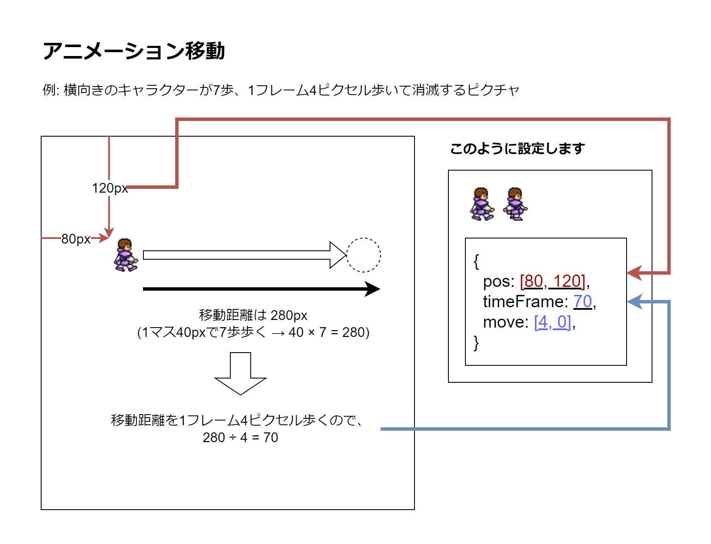

ちなみに「横向きのキャラクターが8歩、5秒間歩いて消えるピクチャを作りたい！ 速度？ そんなものは知らん！」という場合については以下のように書くことはできますが・・・現状はあまりお勧めしません。

```javascript
{
  pos: [80, 120],
  // 300 = 60 * 5
  timeFrame: 300,
  move: [(8 * 40) / (60 * 5), 0],
}
```

理由は2つあります。

1つは移動速度が循環小数になると正確に移動できない場合があるからです。例えば上記の `move` プロパティの `(8 * 40) / (60 * 5)` はこのまま計算するとどうなるでしょうか？ 結果は 1.0666666… になると思います。こうした循環小数になると、30フレーム後は必ず32ピクセルになるとは限りません。そしてフレーム時間は高速で蓄積されていくので、次第に誤差が生じることになります。

2つは1秒ごとに流れるフレーム時間がデバイスによって異なるからです。2020年くらいまでは1秒ごとに流れるフレーム時間、通称「リフレッシュレート」は60回が一般的でした。しかし最近はゲーミングモニターや高性能なスマートフォンを中心に120回に増えることが多くなりました。

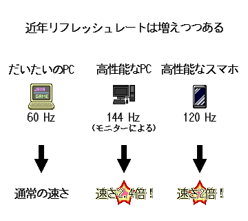

2025年現在、 WWA Wing はそのリフレッシュレートに応じてゲームのスピードが変わってしまう問題を抱えています。この問題はなるべく直そうと考えてはいますが、現時点では一部のPCとスマホでピクチャの流れが大きく変わってしまうことになるのです。

と言うような事情があるので、ピクチャ機能と音楽を活用してタイミングよく押す音ゲーの類についてはうまく作れない可能性が高いです。ご了承ください・・・。

### コラム: time と timeFrame の違い

前回の入門編では `time` プロパティを紹介しましたが、今回の応用編では `timeFrame` プロパティを紹介しました。

両者のプロパティは、ミリ秒時間で処理するか、フレーム時間で処理するか、で異なります。

- `time` プロパティ
    - ミリ秒時間で処理します。例えば `3000` とした場合は3秒後にピクチャが消滅します。
    - 時間単位でピクチャを切り替えたりすることはもちろん、工夫次第でタイマー代わりとして使用できます。
- `timeFrame` プロパティ
    - フレーム時間で処理します。例えば `600` とした場合はリフレッシュレートが 60Hz の場合、10秒後にピクチャが消滅します。
    - ピクチャのアニメーション機能と併用して、アニメーション終了と同時に終わらせたい場合はこのプロパティを使用してください。
    - また、メッセージ表示中のみ表示させたい場合は、 `timeFrame: 1` と指定してください。

ピクチャ動かすなら `timeFrame` そうでないなら `time` とするのが分かりやすいでしょうか。

## 拡大縮小を活用してみよう

先ほどカニが沈むアニメーションを作りましたが、ピクチャ機能でできることはそれだけではありません。拡大縮小で小さくすることもできるんです。

```javascript
ブクブク・・・
<script>
PICTURE(1, {
  // 後述の anchor プロパティで起点がズレるため、右にオフセット
  pos: [200, 240],
  img: [6, 16],
  crop: [2, 1],
  timeFrame: 40,
  // 後述の anchor プロパティがあれば動かす必要はないので move プロパティは削除
  size: [40, 40],
  zoom: [-0.75, -0.1],
  anchor: 2,
});
// 拡大縮小ができれば、目隠し用のピクチャは改めて用意しなくていいので削除
```

- `size: [40, 40]`
    - ピクチャの1マスごとのサイズを横 `40` ピクセル、縦 `40` ピクセルで表示しますよーと示す文です
    - `crop` プロパティや `repeat` プロパティでピクチャが広がった場合、全体のサイズを指定すると小さく見えてしまいますので、1マスごとのサイズで指定してください
    - 今回のサンプルでは、これ自体は無くても変わりません。あくまで参考用として書いています
- `zoom: [-0.75, -1]`
    - ピクチャを1フレームごとに横に `-0.75` ピクセル、縦に `-1` ピクセル拡大縮小しますよーと示す文です
- `anchor: 2`
    - ピクチャの座標や拡大縮小の起点を下中央 (テンキーで `2` は下にあたる) にしますよーと示す文です
    - 指定した起点は、 `pos` プロパティの座標のほかに、 `zoom` プロパティの拡大縮小にも影響します
    - 詳細は後述の画像からどうぞ

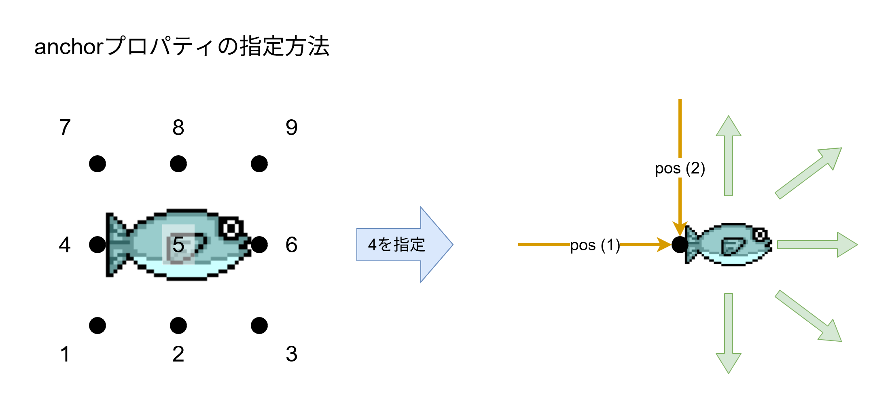

実際に動かすと、カニが小さくなって消える演出を作ることができます。


## 魚の釣り上げをより豪快にしてみよう

ファンタジーアイランドの対岸の島で釣り竿を持っていくと、奥の湖で魚を釣ることができます。このまま魚が手に入るだけでは味気ないので、ピクチャ機能でより豪快にしてみましょう。

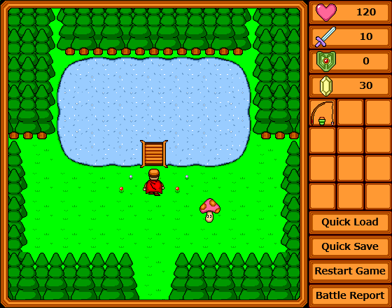

以下のような動きを想定しています。

1. 湖から魚が飛び出て
2. 少しだけ魚が止まり
3. プレイヤーに近づく

物体パーツ58番の「やった！　魚が釣れたぞっ！」のテキストを丸ごと消去して、以下のように差し替えます。「指定位置にパーツを出現」も空にします。

```javascript
<script>
PICTURE(1, {
  pos: [200, 160],
  timeFrame: 80,
  img: [1, 16],
  move: [0, -3],
  accel: [0, 0.05],
  next: [120, 0, 1],
});
```

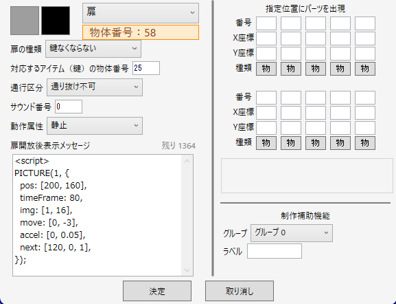

そして物体パーツ120番を以下のメッセージパーツにします。 `<script>` や `PICTURE` などは含めないでください。パーツのイメージ画像は何でもいいですが、今回は透明 (一番左上から横1マスにあるグレーのマス) にします。

```javascript
{
  time: 1000,
  timeFrame: 0,
  move: [0, 0],
  accel: [0, 0],
  next: [121, 0, 1],
}
```

さらに物体パーツ121番を以下のメッセージパーツにします。これもイメージ画像は透明にします。

```javascript
{
  time: 0,
  timeFrame: 80,
  move: [0, 2],
  accel: [0, 0],
  next: [0],
  map: [122, PX, PY],
}
```

さらにさらに、物体パーツ122番をメッセージパーツにし、メッセージテキストは「やった！　魚が釣れたぞっ！」にします。これもイメージ画像は透明にします。

そして「指定位置にパーツを出現」では、元の58番と同じようにプレイヤーの真下に59番（魚のパーツ）を配置するようにします。

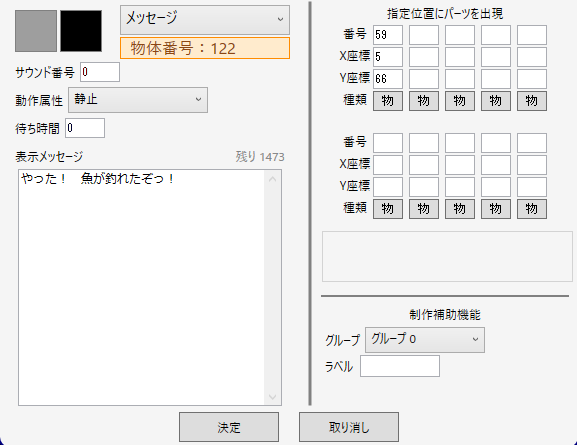

パーツを4つも使用する、複雑な動きになりました。プロパティをそれぞれ解説します。

- `accel: [0, 0.05]`
    - 加速運動です。ピクチャを1フレームごとに `move` プロパティで動かす距離を増減させます。ここでは1フレームごとに 0.05 ピクセル下に `move` プロパティの値を変えていることになります。
    - `move` プロパティとは逆の方向を設定していますが、こうすることで早く動くピクチャにブレーキをかける動作にすることができます。
- `next: [120, 0, 1]`
    - ピクチャが `time` プロパティあるいは `timeFrame` プロパティで消去された場合、次に表示するピクチャを指定します。
    - 左から「次表示するピクチャの定義が書かれたパーツ番号」「パーツ種類」「パーツのプロパティを引き継ぐ」です。
    - ここでは物体パーツ120番のメッセージに書かれたピクチャを、今のピクチャのプロパティを引き継いで表示することになります。

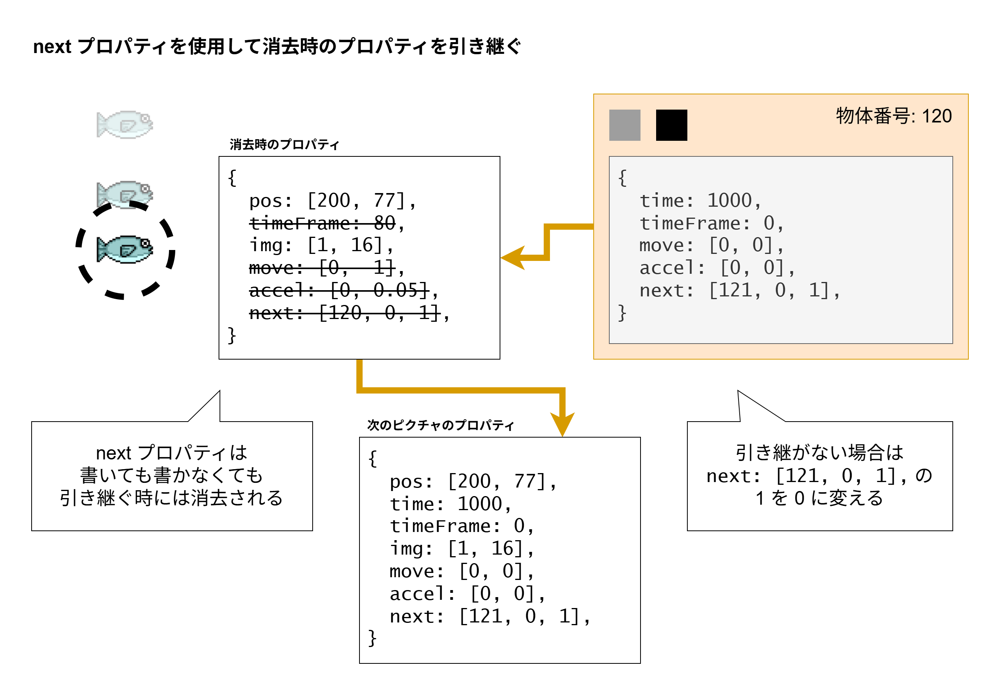

そして次表示する物体パーツ120番ですが、物体パーツ58番に書いたピクチャのプロパティをこのまま引き継ぐため、上書きする形で記載します。

```javascript
{
  // pos は消えた時点でのピクチャの位置をそのまま使用するため、何も記載しない
  // pos や size, opacity などはアニメーションで変わる場合があって、前のピクチャ生成時の値とは一致しない場合があるので要注意
  time: 1000,
  // 元は80フレーム時間で消える設定なので、上書きして消す
  timeFrame: 0,
  // img は今の魚のイメージ画像をそのまま使用するため、何も記載しない
  // 元はピクチャが動いていたので、上書きして静止状態にする
  move: [0, 0],
  accel: [0, 0],
  next: [121, 0, 1],
}
```

次の物体パーツ121番ですが、 `map` プロパティが含まれています。

- `map: [122, PX, PY]`
    - ピクチャが `time` プロパティあるいは `timeFrame` プロパティで消去された場合、配置するパーツを指定します。
    - ここでは物体パーツ122番をプレイヤーに配置します。

という事で、以下のような動きで出来上がりました。 `next` プロパティと `map` プロパティは扱いは難しいですが、組み合わせることでより複雑かつ魅力的な動きを作ることができるので、腕のある方は是非チャレンジしてみてください。

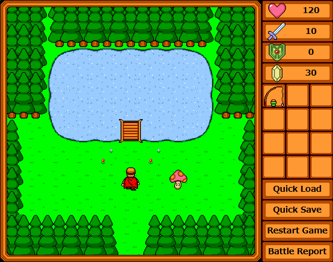

また、ピクチャの定義を `next` プロパティで相互につなげることでループを実現することもできます。

### コラム: 移動中操作を禁止にしたい場合は

この演出を動かしてみると、魚が動いている間にプレイヤーが動けてしまいます。湖のフロアから出てしまうと魚が変なところで動いてしまうことになるので、あまり望ましくありません。

通常なら物体パーツを置いて塞ぐところですが、ピクチャ機能にはプレイヤーの操作を禁止にする `wait` プロパティと `waitFrame` プロパティがあります。

```javascript
<script>
PICTURE(1, {
  pos: [200, 160],
  timeFrame: 80,
  // 追加
  waitFrame: 80,
  img: [1, 16],
  move: [0, -3],
  accel: [0, 0.05],
  next: [120, 0, 1],
});
```

それぞれミリ秒時間とフレーム時間が用意されていますが、アニメーション演出と併用することが多いため、 `waitFrame` の使用が多いことでしょう。

また、ピクチャが消去すると `wait` または `waitFrame` の効果は消えるため、 `waitFrame: 9999` のように大きな値に設定しても同じように動きます。

今回のようにピクチャを4つも扱う演出の場合は、4つすべてのピクチャの定義に含める必要があります。

・・・これが面倒であれば、パーツを置いて塞いだほうがよくね？ と思いますが、プレイヤーの動きを塞いだとしても、アイテムの使用を塞ぐことはできません。

アイテムに任意のコマンドを実行している（例：メニュー画面にワープするアイテムを所持）場合は、パーツでプレイヤーの動きを塞ぐよりも、 `wait` プロパティまたは `waitFrame` プロパティを使用してプレイヤーの動きと、アイテムの使用を塞ぐことをおすすめします。

## 大きな画像をピクチャにして表示してみよう

ここだけは WWA のサンプルゲームに当てはめるものはありません。すみません。

ですが、特に舞台が大きい WWA ゲームを作るとした場合、おそらく地図は必要になると思います。

こういう画像を用意してみました。

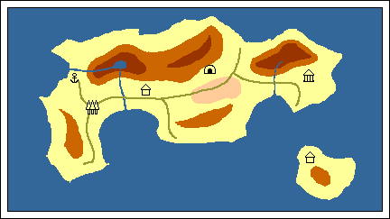

ストーリーのメッセージ表示中に地図の画像を表示することはあると思います。これを使用して `$face` マクロで表示するのかな～と思うところですが、このイラストは横幅432ピクセル、縦幅243ピクセル。WWA のイメージ画像ファイル（横幅400px）にはギリギリ入りません。

ピクチャ機能は、こうしたイメージ画像の制約を無視して、外部画像ファイルを使用することができるんです！

ですが、これを実現するには WWA のマップデータや WWA Script のソースコード以外に編集すべき箇所があります。ご面倒ではありますが、以下の手順に従って準備してください。

1. `picture_file.json` ファイルを作成します。
    
    ```javascript
    {
      "files": {
        "island_map": "./island_map.gif"
      }
    }
    ```
    
2. WWA を遊ぶ HTML ファイルを編集します。
    
    ```html
      <div id="wrapper">
        <div
          class="wwa-size-box"
          id="wwa-wrapper"
          data-wwa-mapdata="picture_test.dat"
          data-wwa-urlgate-enable="true"
          data-wwa-title-img="cover.gif"
          data-wwa-picture-image-names-file="picture_file.json" <!-- これを追加 -->
        ></div>
      </div>
    ```
    
3. 用意した外部画像ファイルを、 WWA を遊ぶ HTML ファイルと同じフォルダーに `island_map.gif` という名前で保存します

今回は GIF 形式で画像を用意しましたが、外部画像ファイルは WWA で使用できるイメージ画像ファイルの制約を超えて、 PNG 画像や JPEG 画像なども使用できます！

ただし大きすぎる画像ファイルは読み込みに時間がかかるため、あらかじめ縮小した状態でご用意ください。ピクチャ機能で映し出せるのは縦横440ピクセルまでです。

準備ができましたら、お次はピクチャのプロパティを書きます。

```javascript
<script>
PICTURE(1, {
  pos: [4, 27],
  // メッセージを閉じたらすぐにピクチャを消去
  // time: 1, でも可能だが、 timeFrame を用いたほうが適切に動作できるのでオススメ
  timeFrame: 1,
  imgFile: "island_map",
});
// メッセージを常に下に表示するために、空の FACE を作成する
FACE(0, 0, 1, 0, 1, 1);
MSG(`昔々、幻の島、アイランド島というものがあってだな、外の人に気付かれることなく過ごしておったんじゃよ。`);
```

こんな感じで外部画像ファイルを使用することができます。

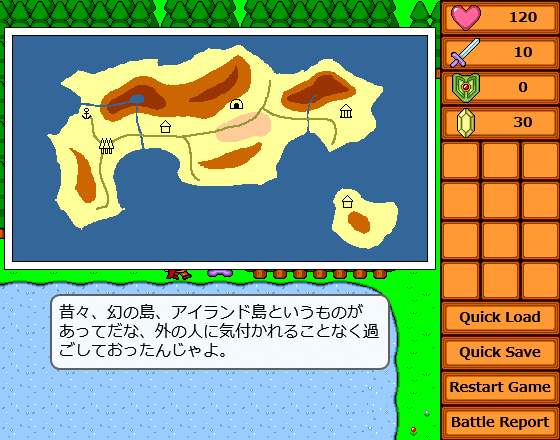

サンプルコードにあった `FACE` 関数を外した状態で実行すると、以下のようにメッセージテキストが被って表示されます。

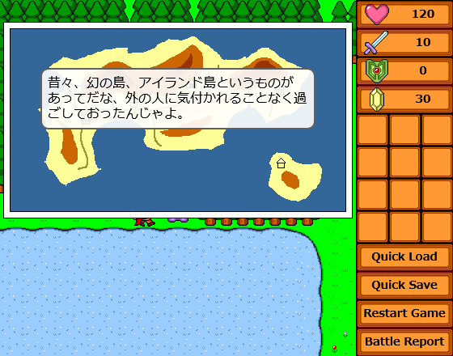

メッセージ表示ではなく、画面上に表示するのであれば、1つ1つ1マスごとにパーツを作成することがないため、実現の手間を省くこともできます。

地図を外部画像にして用いる手法は「[謎めいた機械を追い求めて 闇組織の争奪](https://www.aokashi.net/wwa/strange_machine_next/)」や「[デスゲーム・クリエイティブ・エンターテインメント](https://hirarira.net/wwa/new_wwa/dce/)」に含まれています。

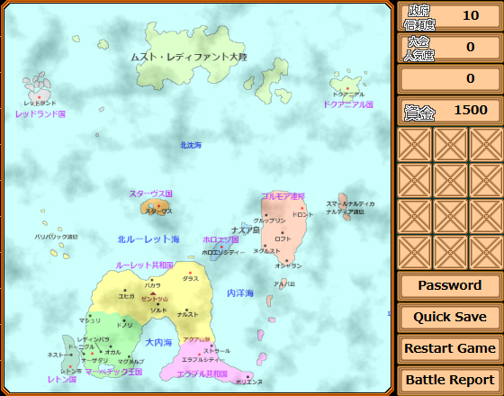

*「デスゲーム・クリエイティブ・エンターテイメント」のオープニングでは、画像を重ねることで地図の質感を表現している*

そして外部画像ファイルも同様にアニメーション関連のプロパティと併用することができます。

## 使用できるプロパティ一覧を一挙に解説！

ここからは紹介してこなかったピクチャ機能のプロパティを解説していきます。

各プロパティは [ピクチャ機能のテストマップ](https://wwawing.com/unstable/picture_test) ですべてサンプルがご覧になれます。

| プロパティ名 | サンプル | 役割 |
| --- | --- | --- |
| fade | `fade: 1.23` | ピクチャを1フレームごとに透明度を `1.23`% 増減する |
| zoomAccel | `zoomAccel: [1, -0.5]` | ピクチャを1フレームごとに `zoom` プロパティで拡大縮小する動きを横に `1` ピクセル、縦に `-0.5` ピクセル増減する |
| circle | `circle: [50, 60, 45, 3]` | ピクチャの `pos` プロパティの座標を起点に、横半径 `50` ピクセル、縦半径 `60` ピクセルで円運動を行う。初期角度は `45` 度とし、1フレームごとに `3` 度角度が増減する |
| sound | `sound: 10` | ピクチャが表示されたタイミングで、 `10` 番の効果音あるいはBGMを再生する (ただし、あらかじめパーツに同じサウンド番号を記載しないと鳴りません) |
| angle | `angle: 180` | ピクチャを `180` 度回転する (現時点の WWA Wing のバージョンでは、他のプロパティと併用すると想定しない動きをします。取扱注意) |
| rotate | `rotate: 3` | ピクチャを1フレームごとに `angle` プロパティで回転する動きを `3` 度増減する |
| create | `create: [[2, 123, 0, 1], [3, 134, 1]]` | ピクチャが時間切れで消去された場合、レイヤー `2` に物体パーツ `123` 番の定義でピクチャを継承して、レイヤー `3` に背景パーツ `134` 番の定義でピクチャを継承しないで作成する。要するに `next` プロパティの複数対応版 |
| script | `script: "startRunning"` | ピクチャが時間切れで消去された場合、 `startRunning` というユーザー定義関数を実行させる |

何かの動きをピクチャ機能に起こしたいな、という時には、これまで紹介したプロパティで表現可能か想像してみてください！

## おわりに

今回の記事では、 WWA のピクチャ機能を使用して様々な演出効果を作る方法を紹介しました。

まず、ボスのカニを倒した時の沈む演出を例に、移動 (`move`) や加速度 (`accel`)、拡大縮小 (`zoom`) を使った基本的な動きの付け方を説明しました。

次に、魚の釣り上げを例に、 `next` プロパティを使った連続した動きの作り方まで、段階的に解説を行いました。

さらに、外部画像ファイルと `picture_file.json` の設定を使用した地図の表示という技法も紹介しました。

また、フレーム時間の扱いや、ピクチャのアニメーションの作り方、プレイヤーの操作を制御する `waitFrame` プロパティを説明しました。

これらの機能を組み合わせることで、単なる情報表示を超えた、より魅力的なゲーム演出を作ることができます。

ピクチャ機能で使用できるプロパティが一通り分かったという事で、自ら演出を実現してみてはいかがですか？

[WWA Wing のサイト](https://wwawing.com) や不安定版の完全版に含まれているサンプルマップでは、ゲームプレイ中に WWA Script のコード実行が含まれていて、そこからすぐに試すことができます。

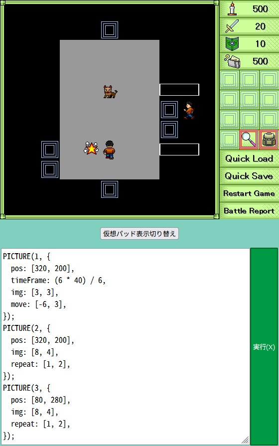

*「謎めいた機械を追い求めて 闇組織の争奪」のコマンドバトルのエフェクトはテストプレイ中に WWA Script のコードを書いて作られていた*

`next` プロパティを用いた連続した動きにおいても、1つ1つの動きを分割したうえで、その場で作って確かめることが可能です。

ただし WWA Script のコード実行を試す場合は、WWA Script の開始を示す `<script>` の文字列は含めないようにしてください。

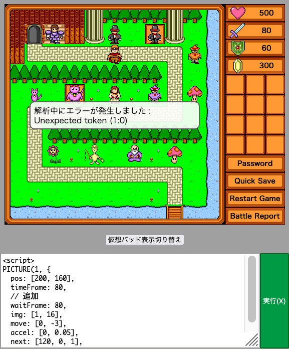

想像が付かない人向きのために、まとまった動作のサンプルを [ピクチャ機能のテストマップ](https://wwawing.com/unstable/picture_test) の下に進んだ所に用意しています。[WWA Wing 不安定版の完全版](https://wwawing.com/downloads/) をダウンロードすると付属しているので、どんな実装になっているか、作成ツールで参考にしてみてください。

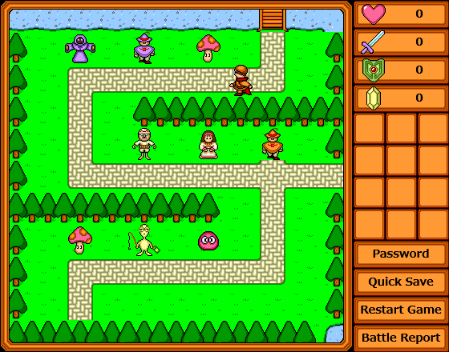

需要があればキャラクターの演出をピクチャ機能に落とし込む方法についても解説するつもりです。

それでは、ピクチャ機能を活用して、あなただけの素晴らしい演出を作り出してください！ 皆様の作品での活用を楽しみにしています。
