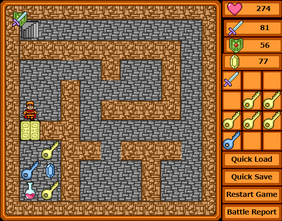

2024年に WWA Wing の不安定版に含まれたピクチャ機能では、ゲーム上に任意のグラフィックを表示させることができます。

WWA Contest 2024 では上位作品を中心にピクチャ機能を活用していて、ゲームステータスの表示やイベント演出、メニュー表示などはこのピクチャ機能で支えられています。


*左から「骸伝：いつか見た虹」「謎めいた機械を追い求めて 闇組織の争奪」「デスゲーム・クリエイティブ・エンターテインメント」*

この記事はピクチャ機能を活用できるようになろう！ という入門記事第1弾です。

最初から WWA を作るよりも、既存の WWA を改造したほうが分かりやすいので、今回は WWA マップ作成ツールに付属している WWA マップ「ケーブダンジョン1」 (caves01) を改造した形で進めます。

## 不安定版のダウンロード

WWA Script もそうですが、ピクチャ機能は不安定版にのみ搭載している機能です。

WWA Wing の公式サイトから、不安定版の完全版をダウンロードしてください。

[WWA Wing](https://wwawing.com/)

ダウンロードした不安定版は、普段制作に使用しているWWAのファイルとは別の場所に展開することをおすすめします。

```
|- WWA
|  |- WinWwamk.exe
|  `- mapdata
|     |- basicgame.dat <- 普段制作しているWWAゲーム
|     |- basicgame.gif
|     |- basicgame.html
|     |- cover.gif
|     |- style.css <- WWA Wing (安定版)
|     |- wwa.css <- WWA Wing (安定版)
|     |- wwa.js <- WWA Wing (安定版)
|     `- wwa-server.exe
|- WWA_unstable
|  |- WinWwamk.exe
|  `- mapdata
|     |- script
|     |  |- defined.js
|     |  |- index.js
|     |  `- script_file_list.json
|     |- caves01.dat <- 今回改造するケーブダンジョン1
|     |- caves01.gif
|     |- caves01.html
|     |- cover.gif
|     |- style.css <- WWA Wing (不安定版)
|     |- wwa.css <- WWA Wing (不安定版)
|     |- wwa.js <- WWA Wing (不安定版)
|     `- wwa-server.exe
```

作成ツールや wwa-server は同じものが含まれているので、ファイル操作に慣れている方は以下のような構成でもいいでしょう。

```
|- WWA
|  |- WinWwamk.exe
|  `- mapdata
|     |- unstable
|     |  |- script <- これも必要です！
|     |  |  |- defined.js
|     |  |  |- index.js
|     |  |  `- script_file_list.json
|     |  |- caves01.dat <- 今回改造するケーブダンジョン1
|     |  |- caves01.gif
|     |  |- caves01.html <- ここはダウンロードした不安定版から取り出してください
|     |  |- cover.gif
|     |  |- style.css <- WWA Wing (不安定版)
|     |  |- wwa.css <- WWA Wing (不安定版)
|     |  `- wwa.js <- WWA Wing (不安定版)
|     |- basicgame.dat
|     |- basicgame.gif
|     |- basicgame.html
|     |- cover.gif
|     |- style.css <- WWA Wing (安定版)
|     |- wwa.css <- WWA Wing (安定版)
|     |- wwa.js <- WWA Wing (安定版)
|     `- wwa-server.exe
```

## 準備したほうがいいもの

ピクチャ機能は WWA Script を使用しなくてもマクロ文で実行することは可能ですが、以下の理由からこの入門記事では WWA Script を使用して説明します。

- 不安定版で WWA Script が組み込まれている
- WWA Script が絶賛開発中であり、今後不具合が起きたときの修正対応がしやすい

WWA Script については以下の入門記事を読んでおくとすんなり進められるかもしれません。

[WWA Script入門：コピペ可、サンプル配布あり！色々やってみよう｜アルクス](https://note.com/wwarcus/n/nb9900d21c64b)

## モンスターを倒すと落とす玉から攻撃力や防御力のアップを可視化しよう

モンスターを倒すと、攻撃力を上げる赤い玉、あるいは防御力を上げる青い玉が手に入ります。

はじめてプレイする人は、赤い玉あるいは青い玉を拾うと何が上がるのか分からないかもしれません。

物体パーツ32番の青い玉のメッセージを追加します。

```javascript
<script>
PICTURE(1, { pos: [20, 20], img: [5, 2], time: 500 });
```


それぞれ解説します。

- `<script>`
    - WWA Script を使用しますよーと示すテキストです
- `PICTURE(...);`
    - これからピクチャを表示しますよーと命令する文です
- `PICTURE(1, { ... });` の `1`
    - レイヤー番号を指定します。詳細は後述します。
- `pos: [20, 20],`
    - そのピクチャは、左上から縦20ピクセル、横20ピクセルに表示しますよーと示す文です
- `img: [5, 2],`
    - そのピクチャの画像は、 WWA イメージ画像で言う左上から横6マス目、縦3マス目、つまり盾の画像を使用しますよーと示す文です
    - ・・・何だよ、横6マス目、縦3マス目じゃないのかよと思うかもしれませんが、 WWA イメージ画像の指定は、0から数えるルールとなっているので、そのような表記になっています

    

- `time: 500`
    - ピクチャは表示されてから0.5秒後には消えますよーと示す文です

**それでも分からん！** ようであれば、お申し付けください。

試しに拾ってみると、左上に盾のマークが表示されると思います。同じように物体パーツ33番の赤い玉にもメッセージを追加してみましょう。


```javascript
<script>
PICTURE(1, { pos: [20, 20], img: [4, 2], time: 500 });
```


ケーブダンジョン1では、他にも青い玉2つと赤い玉2つ、青いクリスタル、赤いクリスタルもあるので、これも同じように対応しましょう。


・・・青い玉2つと赤い玉2つ（物体パーツ36番）はどうするかって？ それは後ほど説明します。

今回の一例は多分誰もが知っているケーブダンジョンですが、自作グラフィックで作るダンジョン WWA だと話は違います。

説明部屋を飛ばして遊んだり、説明部屋を読んでもいまいち頭に入らなかったりする人にとっては分かりやすいことかもしれません。

### 番外編: プレイヤーの座標に表示させてみよう

画面左上に固定で表示されるのが気になりませんか？ プレイヤーの真上に表示したいですか？

・・・できます！

例えば物体パーツ32番の青い玉の場合。少し長いな～となった時は要所要所に改行を入れておくと見やすくなります。

```javascript
<script>
PICTURE(1, {
  pos: [PLAYER_PX, PLAYER_PY - 40],
  img: [5, 2],
  time: 500
});
```

もし動かない場合、 **v4.1.0-unstable.based-on.3.12.11.p.22** 以降でお確かめください。

- `PLAYER_PX` は画面以上にいるプレイヤーのX座標を、 `PLAYER_PY` は同じY座標を表示することができます
- `- 40` が無いとプレイヤーと重なって表示されてしまうため、 Y 座標を引いて上隣に表示させています


試しに動かしてみると、少しずれた場所に表示されますが、一応仕様という事にしておいてください。

サンプルでは物体パーツ34番（青い玉2つ）に書いております。

### 番外編: img プロパティの指定がむず過ぎて無理な人へ

前述の通り、 `img` プロパティは WWA イメージ画像内の座標を指定する必要がありますが、これを特定するには画像を開いて左上から0から順番の数えるか、画像編集ツールで座標を特定して40で割るか、どちらかの作業が発生します。

ケーブダンジョンのような小規模作品ならまだ前者の方法で何とかなりますが、中規模作品以降になるとこの方法では大変なので後者・・・となりますが、結構難しい手順を踏むので簡単にはできません。

やり方は異なりますが、物体パーツ35番（赤い玉2つ）の場合、こんな方法もあります。

1. あらかじめ物体パーツ100番にパーツを作成。「メッセージ」パーツにして、イメージ画像を剣として、以下のメッセージとする
    
    ```javascript
    { pos: [20, 20], time: 500 }
    ```

    
    
2. 物体パーツ35番を以下の通りに変更する
    
    ```javascript
    <script>
    PICTURE_FROM_PARTS(1, 100);
    ```

すでに `img` プロパティを書いている場合は、以下の手順に書き換えることになります。

- `PICTURE(〇, △);` の △ の部分を別パーツに展開
    - イメージ画像はパーツのグラフィックに指定
    - その際に `img: [4, 2]` にあたる部分を消去
- `PICTURE(〇, △);` の `PICTURE` は `PICTURE_FROM_PARTS` に変更
    - △ の部分は先ほど展開したパーツの番号に書き換える

`PICTURE_FROM_PARTS(〇, △);` は、 △ に書いた同じ番号の物体パーツのメッセージを読み込んで、ピクチャにして表示させています。


サンプルでは物体パーツ35番（赤い玉2つ）に書いております。

## 攻撃力と防御力両方アップを可視化しよう

物体パーツ36番の場合、攻撃力も防御力もアップします。剣と盾を両方表示したいですよね？ 以下のようなイメージで表示してみるとします。


```javascript
<script>
PICTURE(1, { pos: [20, 20], img: [4, 2], time: 500 });
PICTURE(1, { pos: [20, 20], img: [5, 2], time: 500 });
```


・・・盾しか表示されませんか？ はい。 `PICTURE(1, { ... });` の `1` が同じ数字の場合、最後に書いたピクチャが優先して表示されます。この数字を変えましょう。

```javascript
<script>
PICTURE(1, { pos: [20, 20], img: [4, 2], time: 500 });
PICTURE(2, { pos: [20, 20], img: [5, 2], time: 500 });
```


・・・ちょっと違いますね。1 と 2 を前後しましょう。

```javascript
<script>
PICTURE(2, { pos: [20, 20], img: [4, 2], time: 500 });
PICTURE(1, { pos: [20, 20], img: [5, 2], time: 500 });
```




*最終的にはこうなります*

うまく表示されました。この数字のことをレイヤー番号と言います。

レイヤー番号が大きいほど優先して前に表示されます。


ピクチャを重ねて表示したい場合、このレイヤー番号は意識する必要があります。

## 現在の階数を表示してみよう

ケーブダンジョン1は地下7階構成ですが、何階にいるのか分からない場合があるかもしれません。

背景パーツ40番を「道」パーツで作成し、以下のメッセージを加えてみましょう。

```javascript
<script>
PICTURE(11, { pos: [380, 20], img: [1, 2] });
PICTURE(12, { pos: [387, 35], text: "1階" });
```


のびやかWWAエディタを使用している場合は、誤配置防止のため「ラベル」の設定をおすすめします！

それぞれ解説します。

- `PICTURE(11, { ... });`
    - 背景の枠をピクチャにして表示します
- `PICTURE(11, { ... });` の `11`
    - 先ほど説明した通り、レイヤー番号です。
    - このままのノリで `1` と指定すると、玉を拾った際に階数の背景が消えてしまいます。同じレイヤーでピクチャを表示すると、既存のピクチャが捨てられてしまうからです。
    - 1つずらして `2` とか `3` とかでもいいですが、レイヤー番号に上限は理論上ないので、贅沢に10番以降は階数表示に割り当てています。
- `PICTURE(12, { ... });`
    - 階数をピクチャにして表示します
- `text: "1階"`
    - そのピクチャは、画像ではなくテキストで表示して、テキストは「1階」としますよーと示す文です

そしてこれをそれぞれ以下の座標に配置します。いずれも、地下1階に来た時に最初に踏み入れる座標です。

- X: 5, Y: 9
- X: 2, Y: 1


さて、実行してみましょう。

お、表示されましたね。


・・・あれ？ 地下2階以降もずっと1階と表示されてしまいますね。


それもそのはず、まだ地下1階の分しか作ってないので、これを地下7階まで進めましょう。

作成ツールの機能でこのままパーツをコピー＆ペーストして、7つ作っちゃいましょう。

1. 背景パーツ40番（コピー元のパーツ）を選択
2. Ctrl キーと C キーを同時押しでコピー実行
3. 横の空いている黒のパーツを選択
4. Ctrl キーと V キーを同時押しでペースト実行


そしてそれぞれの階数に修正して・・・


あとはこれを階段の隣に配置します。ケーブダンジョンは左上から1階、2階、3階・・・という構成になっていますが、4階と5階が入れ替わっているので、そこだけ気を付けましょう。


順番通りに作っていれば背景パーツ40, 41, 42, 43, 44, 45, 46と7パーツできていると思います。

・・・結構大変な作業になりましたが、これで今地下何階にいるのか分かるようになりました。


実用的な WWA でも、ピクチャ機能でこういった情報を表示することで役立ちます。

### 応用: ユーザー定義関数を活用する

ちょっと今のじゃ背後のマップと重なってて見づらいですね。半透明にしてみましょう。

例えば背景パーツ40番の場合、2行目の `PICTURE(1, { pos: [20, 20], img: [1, 2] });` の `img: [1, 2]` の後ろに、 `, opacity: 50` を加えることになります。

```javascript
<script>
PICTURE(11, { pos: [380, 20], img: [1, 2], opacity: 50 });
PICTURE(12, { pos: [387, 35], text: "1階" });
```


・・・これを各階の背景パーツで行うのって、大変ではありませんか？

今後同じように修正が必要な場合、また繰り返し作業が発生することになります。

WWA Script 応用編で取り上げた、ユーザー定義関数を活用することで、この一連の同じ部分を1つのコードで済ませることができます。

[WWA Script応用：コピペ可、サンプル配布あり！色々やってみよう｜アルクス](https://note.com/wwarcus/n/nd52aeeaa6ca4)

`script/index.js` に以下の関数を追加します。基本は説明した WWA Script のソースコードを持ってきてます。

```javascript
function showFloorNumber() {
  PICTURE(11, { pos: [380, 20], img: [1, 2], opacity: 50 });
  PICTURE(12, { pos: [387, 35], text: v["floor"] + "階" });
}
```

関数を追加しましたか？


そうすれば背景パーツ40番は以下のように済みます。

```javascript
<script>
v["floor"] = 1;
showFloorNumber();
```

この書き換えを各階段の背景パーツに行います。


何だよ、また各階で修正かよと思うかもしれませんが、これだけは仕方ありません。頑張って書き換えましょう。最初からこのようなユーザー定義関数を作れば、多少マシになるはずです。

今度は一度階段を昇り降りしたら1秒後に消えるようにしたければ、以下のようにすればいいのです。

```javascript
function showFloorNumber() {
  // この条件判定がないと、階段を降りる前に今の階数が表示されてしまう。前実行した時の階数と比較をして、変わった場合にだけ表示する。
  if (v["prev_floor"] != v["floor"]) {
    PICTURE(11, { pos: [380, 20], img: [1, 2], opacity: 50, time: 1000 });
    PICTURE(12, { pos: [387, 35], text: v["floor"] + "階", time: 1000 });
  }
  v["prev_floor"] = v["floor"];
}
```

サンプルではこの修正後の状態で含まれています。

## コラム: ピクチャを作るときに書くテキストの構造

`PICTURE(1, { pos: [20, 20], img: [4, 2] });` の `{ pos: [20, 20], img: [4, 2] }` という部分をどのように加えているか、気になりませんか？

試しに一部改行を加えて、コメントを足したのが以下のようになります。

```javascript
{ // ブロックのはじまり
  pos: [20, 20], // 1行丸ごとプロパティ
  img: [1, 2], // img はそのプロパティ名で、 [1, 2] はプロパティの値にあたる
} // ブロックの終わり
```

ここから、ピクチャの `pos` とか `img` とかをプロパティと呼びます。ピクチャの定義を書くには、このブロックの間にプロパティをたくさん詰め込んで書くことになります。

自分だけでピクチャの定義を書くために、構造は覚えておきたいですよね？ 5つルールがありますので、その通りに従って書いてください。

ルールその１。必ずブロックのはじまりと終わりを書くこと。

```javascript
{ pos: [20, 20], img: [1, 2] // 終わりがない
```

ルールその２。ブロックの外側は空白以外何も書かないこと。

```javascript
+{ pos: [20, 20], img: [1, 2] }+ // 何すか！ その + という記号は！
```

```javascript
// PICTURE 関数の呼び出しの中ならOK。その枠の間に余計な文字を入れないだけのことです。
PICTURE(1, { pos: [20, 20], img: [1, 2] });
```

ルールその３。各プロパティの書き方に従うこと。

```javascript
{ pos: 100, img: [1, 2] } // pos は [] で囲って , で区切る複数値 (配列) である必要がある
```

ルールその４。プロパティの間はカンマ (,) で区切ること。

```javascript
{ pos: [20, 20] img: [1, 2] } // カンマがない
```

なお、ブロックの終わりの前のカンマは付けても付けなくても構いません。

```javascript
{ pos: [20, 20], img: [1, 2] } // どっちも
{ pos: [20, 20], img: [1, 2], } // ＯＫ
```

ルールその５。プロパティの名前や記号はすべて半角で書くこと。

```javascript
｛ ｐｏｓ：[２０、２０]、img：[1, 2]｝ // 動きません！
```

### 各プロパティの書き方一覧

これまでご紹介したプロパティの一覧を列挙します。

| プロパティ名 | サンプル | サンプルの挙動 |
| --- | --- | --- |
| pos | `[100, 200]` | X座標100、Y座標200にピクチャを表示 |
| img | `[1, 2]` | WWAイメージ画像から、左上から横2マス目、縦3マス目の画像を使用 |
| time | `500` | ピクチャを表示してから0.5秒後にピクチャを消去 |
| text | `“テキスト”` | `テキスト` という文字列を画像の代わりに表示 |

## サンプル配布

これまで改変したケーブダンジョン1のファイルを配布します。

[ケーブダンジョン1 ピクチャ機能改造版](https://wwawing.com/unstable/caves01_picture)
[(zipファイルでダウンロード)](https://wwawing.com/downloads/caves01_picture.zip)

- dat ファイルの読み込みには caves01.gif が必要ですが、今回のサンプルに含まれています。 WWA Wing の完全版と物は同じなので、上書きするかしないかはご自由にどうぞ
- WWA Script のソースとして script/script_file_list.json と script/index.js に関数が追加されています。すでに同じ index.js を編集している方は、上書きで頑張って書いた関数実装が消えないように、うまくやり繰りしてください
- 音声ファイルや wwa.js などは含まれていません
- あくまで参考用としてご活用ください。このままの状態でゲーム投稿サイトに投稿するのは避けてね

## おわりに

今回はピクチャ機能で実用的な、便利情報の表示に焦点を当てて解説しました。

ちょっと変わった書き方だな～・・・と思ったかもしれません。ピクチャ機能は元々 WWAeval のピクチャ表示機能を WWA Wing で再現する目的で開発されました。 WWAeval はもう15年も前の WWA の拡張機能になりますが、パーツにプロパティをつらつらと書くことでイメージを画面上に表示することができました。


次回の応用では、ピクチャ機能の魅力である演出の実現に焦点を当てて解説する予定です。

「ピクチャが表示されないんだけど」「エラーが出た」「これってピクチャ機能で実現できる？」などの質問は WWA Discord コミュニティに是非お寄せください。

[WWA コミュニティについて - WWA FanSquare](https://www.wwafansq.com/community)

この記事を機会に、ピクチャ機能にチャレンジしてみてください。
