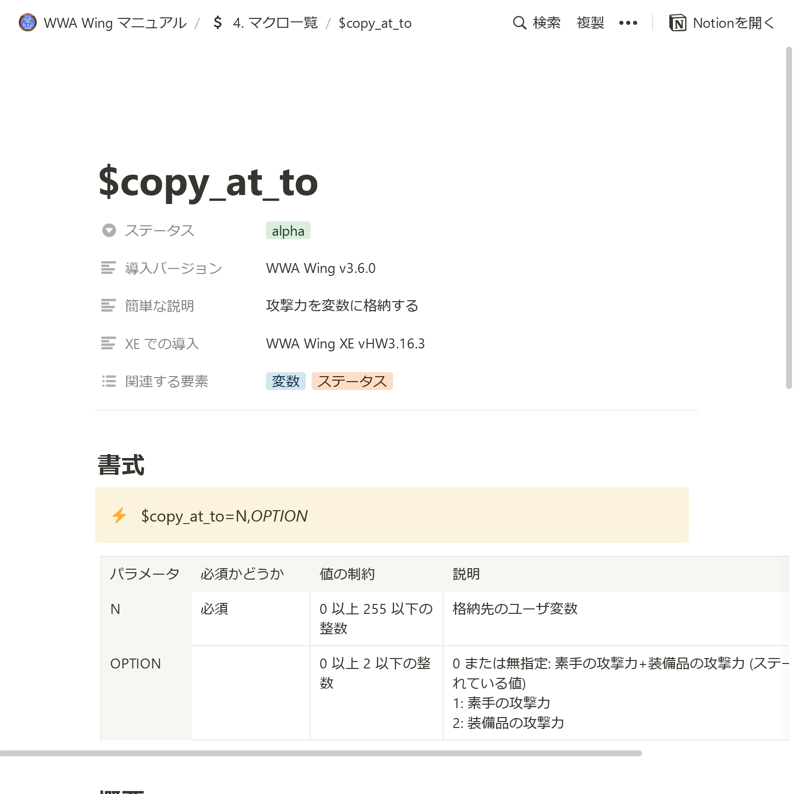

WWA Wing Team です。WWA Wing のマニュアルを Notion で公開しました。下記のリンクからどうぞ。

[WWA Wing マニュアル](https://wwawing.notion.site/wwawing/WWA-Wing-1fca5acaf51a4df38b953c478c8b9a5e)

## WWA Wing マニュアルについて

本マニュアルでは、 WWA Wing の使用方法や各パーツ、各マクロ文の仕様などをまとめています。また、近日リリース予定の WWA Wing v3.6.0 で追加されるマクロ文や変数の仕様なども含まれています。

WWA Wing を使用している方の多くは PLiCy を通じてゲームをアップロードしているはずだと思いますが、ホームページで公開する場合において便利な data-wwa-* 属性や WWA Custom Events などの情報も含まれています。より凝った WWA ゲームを開発したい場合は参考になると思います。

その他にも、開発に便利なツールのご紹介も含まれています。現時点では [WWA Message Loader](https://github.com/aokashi/WWAMessageLoader) のご紹介のみが含まれています。

マニュアルの構成については今後変更になる場合があります。

## 新バージョンのリリースについて

前述の通り、もうすぐ WWA Wing v3.6.0 がリリースされる予定です。このリリースで、変数や条件分岐などの多くのマクロ文が追加されます。マクロ文の仕様を調べる上で、本マニュアルを活用していただくと幸いです。

